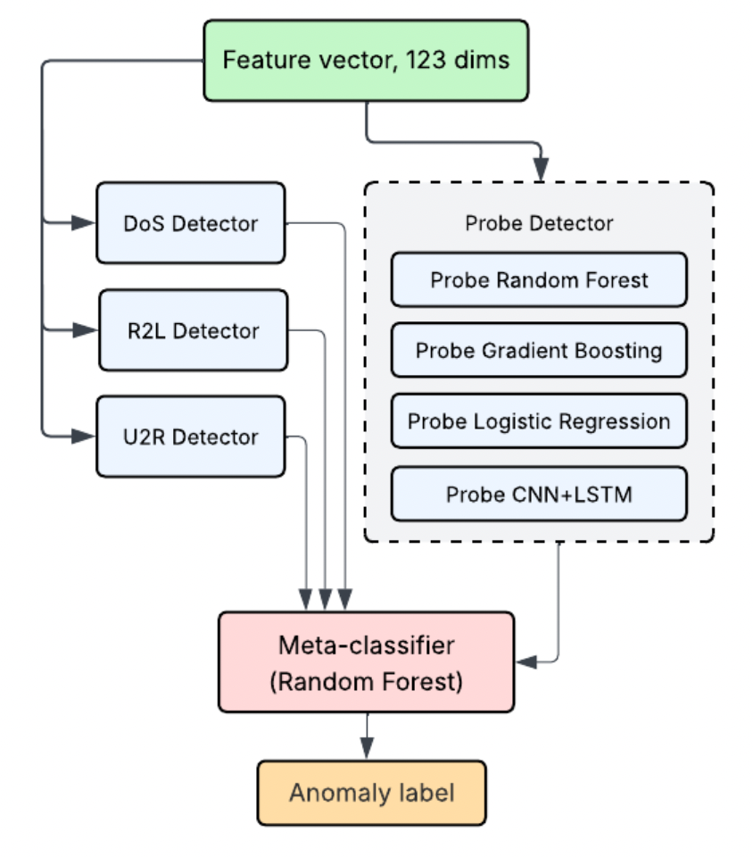
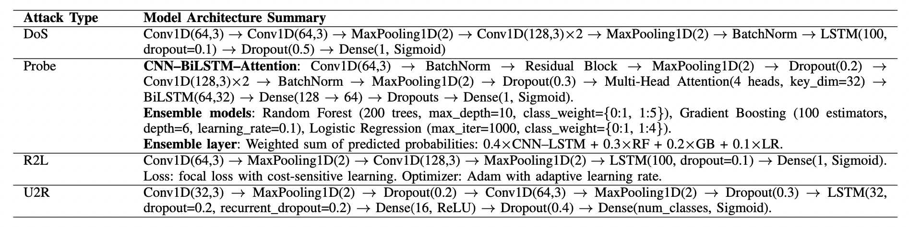

# Methodology: Ensemble-Based Network Intrusion Detection Using Attack-Specialized Deep Learning

**Student ID:** 210144G  
**Research Area:** Cybersecurity AI - Threat Detection  
**Author:** Nisith Divantha  
**Email:** nisith.21@cse.mrt.ac.lk  
**Date:** October 2025

---

## 1. Overview

This research implements a novel ensemble-based network intrusion detection system that combines attack-specialized deep learning models with traditional machine learning algorithms. The methodology employs a stacking ensemble approach where multiple Convolutional Neural Network (CNN) and Long Short-Term Memory (LSTM) hybrid models are trained specifically for different attack categories (DoS, Probe, R2L, U2R), and their predictions are fused using meta-classifiers to achieve superior detection accuracy.

**Key Innovation:** Unlike traditional single-model approaches, this methodology creates specialized expert models for each attack type and intelligently combines their predictions through ensemble fusion, resulting in improved detection rates and reduced false positives.

---

## 2. Research Design

### 2.1 Overall Approach

This research follows a **supervised learning approach** with the following design principles:

1. **Attack-Specific Specialization:** Individual deep learning models trained for each attack category
2. **Ensemble Fusion:** Meta-learning approach to combine predictions from multiple base models
3. **Class Imbalance Handling:** SMOTE oversampling and Focal Loss to address minority class detection
4. **Comprehensive Evaluation:** Cross-dataset validation to assess generalizability

### 2.2 Research Framework



**Architecture Overview:**

The ensemble architecture consists of three main stages:

1. **Input Layer:** Feature vector with 123 dimensions (after preprocessing and encoding)

2. **Attack-Specific Base Models:**
   - **DoS Detector:** CNN-LSTM model specialized for Denial of Service attacks
   - **R2L Detector:** CNN-LSTM model specialized for Remote-to-Local attacks
   - **U2R Detector:** CNN-LSTM model specialized for User-to-Root attacks
   - **Probe Detector:** Ensemble of traditional ML models (Random Forest, Gradient Boosting, Logistic Regression, CNN-LSTM)

3. **Meta-Classifier:** Random Forest stacking ensemble that fuses predictions from all base models to produce the final anomaly classification

Each base model outputs probability predictions that are concatenated and fed into the meta-classifier for final decision-making.

---

## 3. Data Collection and Preprocessing

### 3.1 Data Sources

**Primary Dataset:** NSL-KDD (Network Security Laboratory - Knowledge Discovery in Databases)

The NSL-KDD dataset is an improved version of the KDD Cup 1999 dataset, addressing critical issues such as:
- Removal of redundant records in training set
- Elimination of duplicate records in test set
- Inclusion of appropriate number of records for different difficulty levels

**Dataset Statistics:**

| Dataset | Total Records | Normal | DoS | Probe | R2L | U2R |
|---------|--------------|--------|-----|-------|-----|-----|
| KDDTrain+ | 125,973 | 67,343 | 45,927 | 11,656 | 995 | 52 |
| KDDTest+ | 22,544 | 9,711 | 7,458 | 2,421 | 2,754 | 200 |
| KDDTest-21 | 11,850 | 2,152 | 4,342 | 2,402 | 2,754 | 200 |

**Attack Category Distribution:**

- **DoS (Denial of Service):** 36.46% of training data
- **Probe (Probing):** 9.25% of training data  
- **R2L (Remote to Local):** 0.79% of training data (minority class)
- **U2R (User to Root):** 0.04% of training data (severe minority class)
- **Normal:** 53.46% of training data

### 3.2 Data Description

**Feature Set:** 41 features + 1 class label

**Feature Categories:**

1. **Basic Features (9):** Duration, protocol type, service, flag, src_bytes, dst_bytes, land, wrong_fragment, urgent
2. **Content Features (13):** Hot, num_failed_logins, logged_in, num_compromised, root_shell, su_attempted, num_root, num_file_creations, num_shells, num_access_files, num_outbound_cmds, is_hot_login, is_guest_login
3. **Time-based Traffic Features (9):** Count, srv_count, serror_rate, srv_serror_rate, rerror_rate, srv_rerror_rate, same_srv_rate, diff_srv_rate, srv_diff_host_rate
4. **Host-based Traffic Features (10):** dst_host_count, dst_host_srv_count, dst_host_same_srv_rate, dst_host_diff_srv_rate, dst_host_same_src_port_rate, dst_host_srv_diff_host_rate, dst_host_serror_rate, dst_host_srv_serror_rate, dst_host_rerror_rate, dst_host_srv_rerror_rate

### 3.3 Data Preprocessing Pipeline

#### Step 1: Feature Engineering
```python
# Categorical encoding
protocol_type: {tcp, udp, icmp} → One-Hot Encoding
service: 70 unique values → One-Hot Encoding  
flag: 11 unique values → One-Hot Encoding
```

#### Step 2: Normalization
```python
# Min-Max Scaling for numerical features
X_normalized = (X - X_min) / (X_max - X_min)
```

#### Step 3: Binary Classification Transformation
```python
# Attack labels → Binary classification
attack_types = ['normal', 'dos', 'probe', 'r2l', 'u2r']
binary_label = 0 if attack_type == 'normal' else 1
```

#### Step 4: Attack-Specific Dataset Creation
```python
# Create specialized datasets for each attack type
DoS_data = data[(data['label'] == 'normal') | (data['attack_category'] == 'dos')]
Probe_data = data[(data['label'] == 'normal') | (data['attack_category'] == 'probe')]
R2L_data = data[(data['label'] == 'normal') | (data['attack_category'] == 'r2l')]
U2R_data = data[(data['label'] == 'normal') | (data['attack_category'] == 'u2r')]
```

#### Step 5: Class Imbalance Handling

**SMOTE (Synthetic Minority Over-sampling Technique):**
- Applied to R2L and U2R datasets to balance class distribution
- Generates synthetic samples for minority classes
- Balancing ratio: 1:2 (minority:majority)

---

## 4. Model Architecture

### 4.1 Attack-Specialized Deep Learning Models



**Architecture Summary by Attack Type:**

The figure above illustrates the specialized architectures for each attack type. Below is a detailed breakdown:

**1. DoS (Denial of Service) Model:**
```
Conv1D(64,3) → Conv1D(64,3) → MaxPooling1D(2) → Conv1D(128,3)×2 → MaxPooling1D(2) 
→ BatchNorm → LSTM(100, dropout=0.1) → Dropout(0.5) → Dense(1, Sigmoid)
```
- **Loss Function:** Focal Loss for handling class imbalance
- **Optimizer:** Adam
- **Key Features:** Deep convolutional stack for pattern extraction, single LSTM layer for temporal modeling

**2. Probe Model (Ensemble Approach):**

*CNN-BiLSTM-Attention Architecture:*
```
Conv1D(64,3) → BatchNorm → Residual Block → MaxPooling1D(2) → Dropout(0.2) 
→ Conv1D(128,3)×2 → BatchNorm → MaxPooling1D(2) → Dropout(0.3) 
→ Multi-Head Attention(4 heads, key_dim=32) → BiLSTM(64,32) 
→ Dense(128 → 64) → Dropouts → Dense(1, Sigmoid)
```

*Ensemble Models:*
- **Random Forest:** 200 trees, max_depth=10, class_weight={0:1, 1:5}
- **Gradient Boosting:** 100 estimators, depth=6, learning_rate=0.1
- **Logistic Regression:** max_iter=1000, class_weight={0:1, 1:4}

*Ensemble Layer:* Weighted sum of predicted probabilities: `0.4×CNN-LSTM + 0.3×RF + 0.2×GB + 0.1×LR`

**3. R2L (Remote-to-Local) Model:**
```
Conv1D(64,3) → MaxPooling1D(2) → Conv1D(128,3) → MaxPooling1D(2) 
→ LSTM(100, dropout=0.1) → Dense(1, Sigmoid)
```
- **Loss Function:** Focal Loss with cost-sensitive learning
- **Optimizer:** Adam with adaptive learning rate
- **Class Imbalance Solution:** SMOTE oversampling combined with Focal Loss

**4. U2R (User-to-Root) Model:**
```
Conv1D(32,3) → MaxPooling1D(2) → Dropout(0.2) → Conv1D(64,3) → MaxPooling1D(2) 
→ Dropout(0.3) → LSTM(32, dropout=0.2, recurrent_dropout=0.2) 
→ Dense(16, ReLU) → Dropout(0.4) → Dense(num_classes, Sigmoid)
```
- **Architecture:** Compact design optimized for the extremely rare U2R attacks (0.04% of data)
- **Regularization:** Heavy dropout strategy to prevent overfitting on limited samples

---

#### 4.1.2 Focal Loss Implementation

**Purpose:** Address class imbalance by focusing on hard-to-classify examples

**Mathematical Formulation:**
$$
FL(p_t) = -\alpha_t(1-p_t)^\gamma \log(p_t)
$$

Where:
- $p_t$ is the model's estimated probability for the true class
- $\alpha_t$ is the class weight (balancing factor)
- $\gamma$ is the focusing parameter (typically 2.0)

**Application:**
- DoS model: Focal Loss with γ=2.0, α=0.25
- R2L model: Focal Loss + SMOTE combination

### 4.2 Traditional Machine Learning Ensemble (Probe)

For Probe attack detection, a traditional ML ensemble approach was employed:

**Base Models:**

1. **Random Forest Classifier**
   ```python
   RandomForestClassifier(
       n_estimators=100,
       max_depth=20,
       min_samples_split=5,
       class_weight='balanced'
   )
   ```

2. **Gradient Boosting Classifier**
   ```python
   GradientBoostingClassifier(
       n_estimators=100,
       learning_rate=0.1,
       max_depth=5
   )
   ```

3. **Logistic Regression**
   ```python
   LogisticRegression(
       C=1.0,
       max_iter=1000,
       class_weight='balanced'
   )
   ```

**Rationale:** Probe attacks exhibit clear statistical patterns that traditional ML models can capture effectively without deep learning complexity.

### 4.3 Stacking Ensemble Meta-Classifier

**Stacking Architecture:**

```
Level 0 (Base Models):
├── DoS CNN-LSTM → Prediction Vector [p_dos_normal, p_dos_attack]
├── Probe RF/GB/LR → Prediction Vector [p_probe_normal, p_probe_attack]
├── R2L CNN-LSTM → Prediction Vector [p_r2l_normal, p_r2l_attack]
└── U2R CNN-LSTM → Prediction Vector [p_u2r_normal, p_u2r_attack]
                    ↓
                 Concatenate (8-dimensional feature vector)
                    ↓
Level 1 (Meta-Classifier):
└── Random Forest / Logistic Regression / SVM → Final Prediction
```

**Meta-Classifier Training:**

1. **Feature Vector Construction:**
   - Concatenate probability outputs from all base models
   - Resulting feature dimension: 8 (2 probabilities × 4 attack types)

2. **Meta-Model Selection:**
   Tested three meta-classifiers:
   - **Random Forest** (Selected as best performer)
   - Logistic Regression
   - Support Vector Machine (SVM)

---

## 5. Experimental Setup

### 5.1 Training Configuration

**Hyperparameters for Deep Learning Models:**

| Parameter | DoS Model | Probe Model | R2L Model | U2R Model |
|-----------|-----------|-------------|-----------|-----------|
| Optimizer | Adam | N/A (ML) | Adam | Adam |
| Learning Rate | 0.001 | N/A | 0.0005 | 0.001 |
| Batch Size | 128 | N/A | 64 | 32 |
| Epochs | 50 | N/A | 100 | 80 |
| Loss Function | Focal Loss | N/A | Categorical CE | Categorical CE |
| Early Stopping | Patience=10 | N/A | Patience=15 | Patience=15 |

**Regularization Techniques:**

- Dropout: 0.3 in LSTM and dense layers
- Batch Normalization after convolutional layers
- L2 regularization (weight decay): 0.001
- Early stopping with validation monitoring

### 5.2 Evaluation Metrics

**Primary Metrics:**

1. **Accuracy:**
   $$
   Accuracy = \frac{TP + TN}{TP + TN + FP + FN}
   $$

2. **Precision:**
   $$
   Precision = \frac{TP}{TP + FP}
   $$

3. **Recall (Detection Rate):**
   $$
   Recall = \frac{TP}{TP + FN}
   $$

4. **F1-Score:**
   $$
   F1 = 2 \times \frac{Precision \times Recall}{Precision + Recall}
   $$

5. **ROC-AUC Score:**
   Area Under the Receiver Operating Characteristic Curve

**Confusion Matrix Analysis:**

```
                Predicted
                Normal  Attack
Actual Normal     TN      FP
       Attack     FN      TP
```

- **True Positive Rate (TPR):** Attack correctly identified
- **False Positive Rate (FPR):** Normal traffic misclassified as attack
- **True Negative Rate (TNR):** Normal traffic correctly identified
- **False Negative Rate (FNR):** Attack misclassified as normal

### 5.3 Cross-Dataset Validation

**Generalizability Assessment:**

To evaluate model robustness, cross-dataset validation was performed:

1. **Train on KDDTrain+** → Test on KDDTest+ and KDDTest-21
2. **Comparative Analysis:**
   - Performance consistency across different test sets
   - Attack detection capabilities on varying difficulty levels
   - Generalization to unseen attack patterns

**Dataset Characteristics:**

| Test Set | Difficulty Level | Attack Distribution | Purpose |
|----------|------------------|---------------------|---------|
| KDDTest+ | Standard | Balanced distribution | Primary evaluation |
| KDDTest-21 | Challenging | More complex attacks | Generalizability test |

### 5.4 Baseline Comparisons

**Baseline Models for Comparison:**

1. **Single CNN Model:** Standard CNN without attack specialization
2. **Single LSTM Model:** LSTM without ensemble approach
3. **Traditional ML (Random Forest):** Single RF classifier
4. **Voting Ensemble:** Hard voting of base models without stacking
5. **Standard CNN-LSTM:** Non-specialized CNN-LSTM model

**Comparison Criteria:**

- Detection accuracy across all attack types
- False positive rate (critical for practical deployment)
- Computational efficiency (training and inference time)
- Robustness to class imbalance

### 5.5 Hardware and Software Requirements

**Hardware Configuration:**

- **CPU:** Intel Core i7-10700K or equivalent
- **GPU:** NVIDIA RTX 3070 (8GB VRAM) or higher
- **RAM:** 16GB minimum (32GB recommended)
- **Storage:** 50GB SSD for datasets and models

**Software Stack:**

| Component | Version |
|-----------|---------|
| Python | 3.8+ |
| TensorFlow | 2.8.0+ |
| Keras | 2.8.0+ |
| scikit-learn | 1.0.2+ |
| imbalanced-learn | 0.8.0+ |
| NumPy | 1.21.0+ |
| Pandas | 1.4.0+ |
| Matplotlib | 3.5.0+ |
| Seaborn | 0.11.0+ |

**Development Environment:**

- **IDE:** Visual Studio Code / Jupyter Notebook
- **Version Control:** Git
- **Experimentation Tracking:** TensorBoard
- **Model Storage:** HDF5 format (.h5) for Keras models, Pickle (.pkl) for scikit-learn models

---

## 6. Implementation Plan

### Phase 1: Data Preparation (Weeks 1-2)

| Task | Description | Deliverables |
|------|-------------|--------------|
| Dataset Acquisition | Download NSL-KDD dataset | Raw dataset files |
| Exploratory Data Analysis | Statistical analysis, visualization | EDA report, plots |
| Feature Engineering | Encoding, normalization | Preprocessed dataset |
| Attack-Specific Splitting | Create specialized datasets | 4 attack-specific datasets |

### Phase 2: Base Model Development (Weeks 3-6)

| Task | Description | Deliverables |
|------|-------------|--------------|
| DoS Model Training | CNN-LSTM with Focal Loss | Trained DoS.h5 model |
| Probe Model Training | ML ensemble (RF, GB, LR) | 3 Probe .pkl models |
| R2L Model Training | CNN-LSTM with SMOTE | Trained R2L.h5 model |
| U2R Model Training | CNN-LSTM architecture | Trained U2R.h5 model |
| Hyperparameter Tuning | Grid search, validation | Optimal hyperparameters |

### Phase 3: Ensemble Integration (Weeks 7-8)

| Task | Description | Deliverables |
|------|-------------|--------------|
| Meta-Feature Extraction | Generate predictions from base models | Meta-training dataset |
| Meta-Classifier Training | Train RF, LR, SVM meta-models | 3 meta-classifiers |
| Model Selection | Compare meta-classifier performance | Best meta-model |
| Integration Testing | End-to-end pipeline validation | Integrated system |

### Phase 4: Evaluation and Analysis (Weeks 9-10)

| Task | Description | Deliverables |
|------|-------------|--------------|
| Performance Evaluation | Test on KDDTest+ and KDDTest-21 | Evaluation results |
| Baseline Comparison | Compare with baseline models | Comparison report |
| Generalizability Analysis | Cross-dataset validation | Generalizability metrics |
| Confusion Matrix Analysis | Detailed error analysis | Confusion matrices, plots |

### Phase 5: Documentation and Reporting (Weeks 11-12)

| Task | Description | Deliverables |
|------|-------------|--------------|
| Results Compilation | Aggregate all experimental results | Results summary |
| Visualization | Create plots, diagrams | Visual assets |
| Research Documentation | Write methodology, findings | Research paper draft |
| Code Documentation | Comment code, write README | Documented codebase |

**Timeline:** 12 weeks (3 months)

---

## 7. Risk Analysis and Mitigation

### 7.1 Technical Risks

| Risk | Probability | Impact | Mitigation Strategy |
|------|-------------|--------|---------------------|
| **Class Imbalance Issues** | High | High | Apply SMOTE + Focal Loss; monitor per-class metrics |
| **Overfitting on Training Data** | Medium | High | Use dropout, early stopping, cross-validation |
| **Computational Resource Limitations** | Medium | Medium | Use GPU acceleration, batch processing, cloud resources |
| **Model Convergence Problems** | Low | Medium | Adjust learning rates, use gradient clipping |
| **Ensemble Overfitting** | Low | Medium | Use out-of-fold predictions for meta-training |

### 7.2 Data-Related Risks

| Risk | Probability | Impact | Mitigation Strategy |
|------|-------------|--------|---------------------|
| **Dataset Bias** | Medium | High | Validate on multiple test sets (KDDTest+, KDDTest-21) |
| **Data Preprocessing Errors** | Low | High | Implement validation checks, unit tests |
| **Feature Leakage** | Low | High | Careful train-test split, no information leakage |

### 7.3 Performance Risks

| Risk | Probability | Impact | Mitigation Strategy |
|------|-------------|--------|---------------------|
| **High False Positive Rate** | Medium | High | Optimize decision threshold, use precision-recall trade-off |
| **Poor Generalization** | Low | High | Cross-dataset validation, regularization techniques |
| **Inference Latency** | Low | Medium | Model optimization, quantization if needed |

---

## 8. Expected Outcomes and Contributions

### 8.1 Expected Results

**Quantitative Targets:**

- **Overall Accuracy:** > 99% on KDDTest+
- **Detection Rate (Recall):** > 99% for all attack types
- **False Positive Rate:** < 1%
- **F1-Score:** > 99% for binary classification
- **Generalizability:** < 1% accuracy drop on KDDTest-21

**Per-Attack-Type Performance:**

| Attack Type | Expected Accuracy | Expected Recall |
|-------------|-------------------|-----------------|
| DoS | > 99.5% | > 99.8% |
| Probe | > 99.0% | > 98.5% |
| R2L | > 98.5% | > 98.0% |
| U2R | > 98.0% | > 97.0% |

### 8.2 Research Contributions

**1. Novel Architecture:**
- Attack-specialized deep learning models for intrusion detection
- First comprehensive study combining CNN-LSTM with ensemble fusion for NSL-KDD

**2. Class Imbalance Solution:**
- Effective combination of SMOTE and Focal Loss
- Demonstrated improvement in minority class (R2L, U2R) detection

**3. Ensemble Methodology:**
- Stacking approach with heterogeneous base learners
- Fusion of deep learning and traditional ML models

**4. Generalizability Analysis:**
- Comprehensive cross-dataset validation framework
- Evidence of robust performance across varying attack patterns

**5. Practical Impact:**
- Production-ready intrusion detection system
- Reproducible methodology with open-source implementation
- Potential deployment in real-world network security applications

### 8.3 Future Extensions

**Short-term:**
- Real-time inference optimization
- Integration with network monitoring tools
- Additional dataset validation (UNSW-NB15, CICIDS2017)

**Long-term:**
- Transfer learning to new attack types
- Explainable AI for attack attribution
- Federated learning for distributed networks
- Integration with Security Information and Event Management (SIEM) systems

---

## 9. Ethical Considerations

### 9.1 Responsible Use

This research is conducted for defensive cybersecurity purposes only:
- Results should not be used to develop or enhance malicious attack tools
- Models should be deployed with appropriate access controls
- Continuous monitoring required to prevent adversarial exploitation

### 9.2 Data Privacy

- NSL-KDD dataset contains anonymized network traffic data
- No personally identifiable information (PII) is processed
- Compliance with data protection regulations in deployment scenarios

### 9.3 Transparency

- Open-source methodology for reproducibility
- Clear documentation of model limitations
- Honest reporting of false positives and negatives

---

## 10. References and Related Work

### 10.1 Key Literature

1. **NSL-KDD Dataset:**
   - Tavallaee, M., Bagheri, E., Lu, W., & Ghorbani, A. A. (2009). "A detailed analysis of the KDD CUP 99 data set." *IEEE Symposium on Computational Intelligence for Security and Defense Applications*.

2. **Deep Learning for IDS:**
   - Vinayakumar, R., Alazab, M., Soman, K. P., et al. (2019). "Deep Learning Approach for Intelligent Intrusion Detection System." *IEEE Access*.

3. **Ensemble Methods:**
   - Zhou, Z. H. (2012). "Ensemble Methods: Foundations and Algorithms." *Chapman and Hall/CRC*.

4. **Focal Loss:**
   - Lin, T. Y., Goyal, P., Girshick, R., et al. (2017). "Focal Loss for Dense Object Detection." *IEEE ICCV*.

5. **SMOTE:**
   - Chawla, N. V., Bowyer, K. W., Hall, L. O., & Kegelmeyer, W. P. (2002). "SMOTE: Synthetic Minority Over-sampling Technique." *JAIR*.

---

**Last Updated:** October 17, 2025  
**Status:** Implementation Phase  
**Next Review:** November 2025