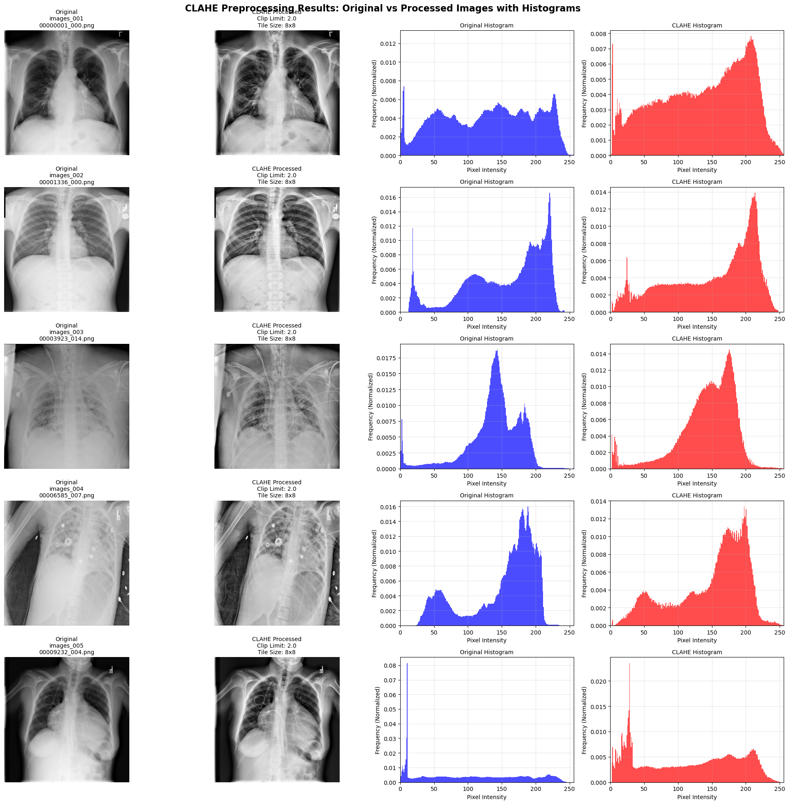

# Experiment 4 — Preprocessing: CLAHE (Contrast Limited Adaptive Histogram Equalization)

Why CLAHE?
-----------
After applying CLAHE, the chest X-ray images showed improved local contrast, making darker regions clearer and subtle disease patterns (e.g., small nodules, infiltrations) more visible. The intent was to help the model focus on medically relevant local details while avoiding global over-enhancement of noise.

Kaggle preprocessed dataset
---------------------------
The preprocessed images used in this experiment are published as a Kaggle dataset by me: https://www.kaggle.com/datasets/laksaraky210329e/nih-chest-x-rays-preprocessed-version

Sample output
-------------
Below is a representative example showing the original image (left) and the CLAHE-processed image (right). If the image does not render (e.g., in plain-text viewers), open `images/output.png`.

Re-evaluation using CLAHE-preprocessed images
---------------------------------------------
The reproduced DannyNet model was re-evaluated using the CLAHE-preprocessed images for this experiment; the results below are from that run.
All replication and CLAHE experiments reported here were run using the same random seed (`42`) for reproducibility.

### Test summary

| Metric     | Value  |
|------------|:------:|
| Loss       | 0.0415 |
| Avg AUROC  | 0.8514 |
| Avg F1     | 0.3803 |

### Per-class metrics

| Class                 | AUROC  | F1      | Threshold |
|-----------------------|:------:|:-------:|:---------:|
| Atelectasis           | 0.8146 | 0.4116  | 0.3883    |
| Cardiomegaly          | 0.9325 | 0.4793  | 0.3564    |
| Consolidation         | 0.7871 | 0.2436  | 0.3169    |
| Edema                 | 0.8841 | 0.3019  | 0.3974    |
| Effusion              | 0.9015 | 0.6048  | 0.4216    |
| Emphysema             | 0.9656 | 0.5526  | 0.3198    |
| Fibrosis              | 0.8207 | 0.1250  | 0.3314    |
| Hernia                | 0.9936 | 0.7059  | 0.7221    |
| Infiltration          | 0.7044 | 0.4073  | 0.3760    |
| Mass                  | 0.9122 | 0.4762  | 0.4317    |
| Nodule                | 0.7780 | 0.3463  | 0.3452    |
| Pleural Thickening    | 0.8124 | 0.2583  | 0.2924    |
| Pneumonia             | 0.7229 | 0.0678  | 0.2317    |
| Pneumothorax          | 0.8902 | 0.3439  | 0.2913    |

Comparison (AUROC)
-------------------
| Pathology           | DannyNet (paper) | DannyNet (replication) | DannyNet (replication) + CLAHE |
|---------------------|------------------:|-----------------------:|-----------------:|
| Atelectasis         | 0.817             | 0.8181                 | 0.8146           |
| Cardiomegaly        | 0.932             | 0.9280                 | 0.9325           |
| Consolidation       | 0.783             | 0.7810                 | 0.7871           |
| Edema               | 0.896             | 0.8782                 | 0.8841           |
| Effusion            | 0.905             | 0.8975                 | 0.9015           |
| Emphysema           | 0.963             | 0.9606                 | 0.9656           |
| Fibrosis            | 0.814             | 0.8216                 | 0.8207           |
| Hernia              | 0.997             | 0.9951                 | 0.9936           |
| Infiltration        | 0.708             | 0.6986                 | 0.7044           |
| Mass                | 0.919             | 0.9047                 | 0.9122           |
| Nodule              | 0.789             | 0.7736                 | 0.7780           |
| Pleural Thickening  | 0.801             | 0.7988                 | 0.8124           |
| Pneumonia           | 0.740             | 0.7209                 | 0.7229           |
| Pneumothorax        | 0.875             | 0.8831                 | 0.8902           |

Conclusion
----------
CLAHE preprocessing produced measurable changes: per-class AUROC improved for several pathologies and the average AUROC is comparable to the replication baseline. In this run, CLAHE appears beneficial for classes such as Cardiomegaly, Mass, Pleural Thickening and Pneumothorax and shows a small positive impact on average AUROC. However, improvements are class-dependent and should be interpreted cautiously — further controlled experiments and cross-validation are recommended to confirm generalizability.

Reproducibility note
--------------------
All reported replication and CLAHE evaluation runs were executed with the random seed set to `42` to ensure deterministic data splits and comparable results across experiments.

Why I did NOT crop/segment to lung-only masks
-----------------------------------------------
I intentionally did not crop or segment images to the lung parenchyma (i.e. applying a lung mask) before training/evaluation. Cropping to lung-only regions removes important contextual information that the model needs for several labels that appear outside or at the borders of the lung interior. Examples include:

- Cardiomegaly — requires seeing the heart silhouette and mediastinal contours.
- Pleural Effusion — fluid often accumulates in pleural spaces outside the lung parenchyma and along the costophrenic angles.
- Pleural Thickening — appears on pleural surfaces and may be missed if only lung interiors are retained.
- Hernia — may present outside the lung fields and require the whole thoracic/upper abdominal view.
- Some Masses/Nodules — depending on location, cropping to lungs can remove peripheral or juxta-pleural lesions.

For these reasons, I kept the whole thoracic image so the model can learn from both intra- and extra-pulmonary cues

