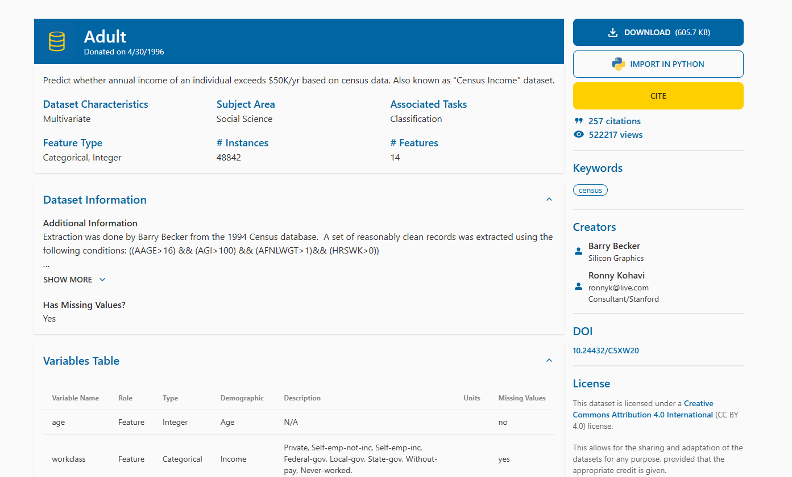
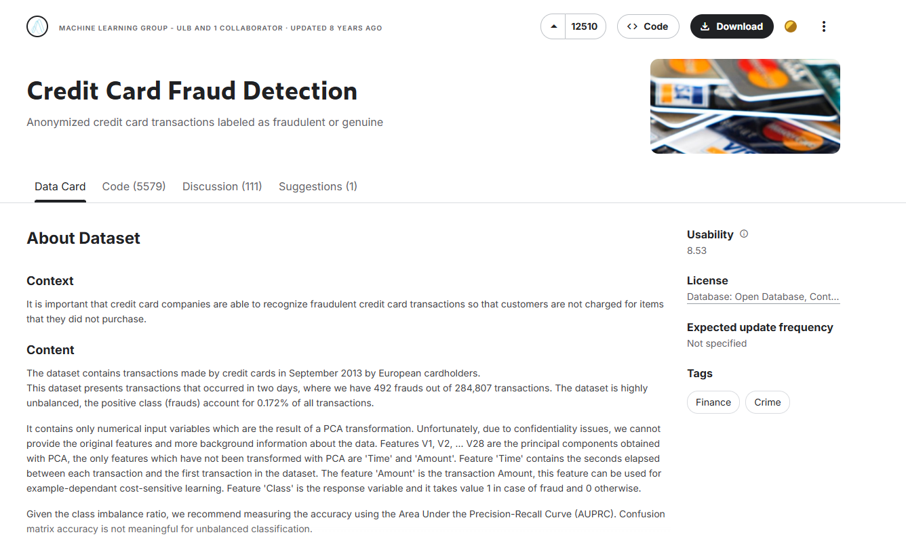
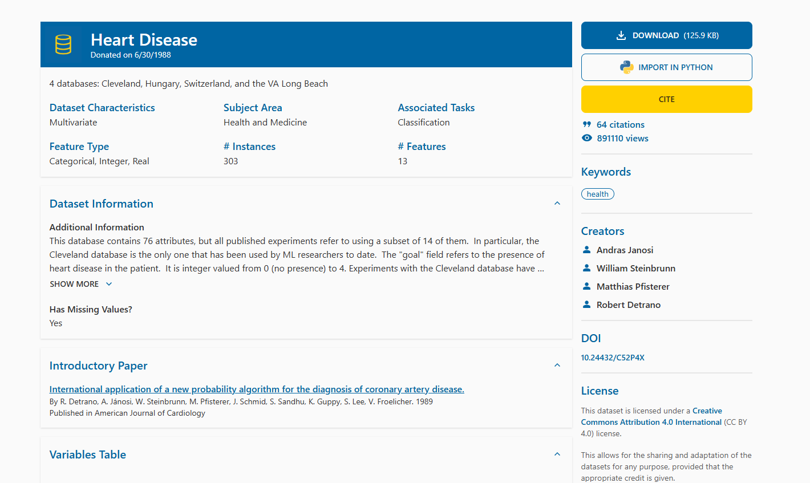

# Datasets Used

This project evaluates the proposed enhancements to the **Explainable Boosting Machine (EBM)** model using three standard benchmark datasets from diverse domains. Each dataset is chosen to assess performance, interpretability, and fairness across different real-world contexts.

---

## 1. Adult Income Dataset (UCI Census Income)
- **Domain:** Finance / Socioeconomic prediction  
- **Source:** UCI Machine Learning Repository  
- **Description:**  
  Predicts whether an individual earns more than \$50K annually based on demographic and employment features such as age, education, occupation, and marital status.  
- **Purpose in Study:**  
  Used for fairness-aware experiments where **sex** is treated as a sensitive attribute to evaluate demographic parity.  

---

## 2. Credit Card Fraud Detection Dataset
- **Domain:** Security / Financial anomaly detection  
- **Source:** European Credit Card Transactions Dataset  
- **Description:**  
  Highly imbalanced dataset containing anonymized features of transactions labeled as **fraudulent** or **legitimate**.  
- **Purpose in Study:**  
  Used to test model robustness and discriminative power under **class imbalance**.  

---

## 3. UCI Heart Disease Dataset
- **Domain:** Healthcare / Clinical prediction  
- **Source:** UCI Machine Learning Repository  
- **Description:**  
  Contains clinical and physiological attributes such as age, cholesterol level, blood pressure, and chest pain type to predict the presence of **heart disease**.  
- **Purpose in Study:**  
  Used to assess the EBM’s interpretability and sensitivity to **medically relevant features**.  

---

### Summary Table

| Dataset           | Domain     | Task                  | Mean ROC AUC | Notes                                    |
| ----------------- | ---------- | --------------------- | ------------ | ---------------------------------------- |
| Adult Income      | Finance    | Income classification | 0.930        | Fairness evaluation (Demographic Parity) |
| Credit Card Fraud | Security   | Fraud detection       | 0.985        | Imbalanced classification benchmark      |
| UCI Heart Disease | Healthcare | Disease prediction    | 0.901        | Medical interpretability assessment      |

---

### References
- UCI Machine Learning Repository: [https://archive.ics.uci.edu/dataset/2/adult](https://archive.ics.uci.edu/dataset/2/adult)  
- European Credit Card Fraud Dataset: [https://www.kaggle.com/mlg-ulb/creditcardfraud](https://www.kaggle.com/mlg-ulb/creditcardfraud)
- UCI Heart Disease Dataset: [https://archive.ics.uci.edu/dataset/45/heart+disease](https://archive.ics.uci.edu/dataset/45/heart+disease)
