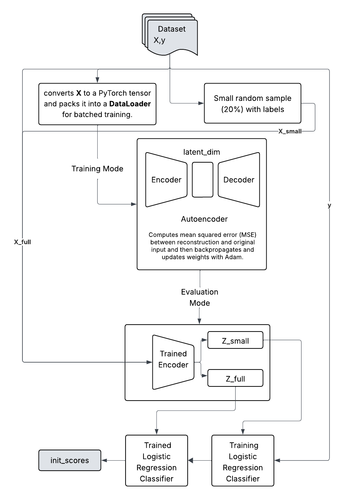

# Methodology: Explainable Boosting Machines (EBM) Implementation

**Student:** 210343P  
**Research Area:** Interpretable Machine Learning / Explainable AI  
**Date:** 2025-10-07  

---

## 1. Overview

This methodology outlines the design and implementation of an **Explainable Boosting Machine (EBM)** framework for interpretable machine learning. The workflow includes three primary stages:  
1. Baseline EBM model training using the **InterpretML** library.  
2. **Bayesian hyperparameter optimization (HPO)** via Optuna, with both performance-only and fairness-aware objectives.  
3. **Pretraining using self-supervised learning** to mitigate the cold-start problem and improve stability in low-label scenarios.

---

## 2. Research Design

The research adopts a **quantitative experimental design**, evaluating different EBM configurations across standard datasets (Adult Income, Credit Card Fraud, and UCI Heart Disease).  
The methodology integrates **performance evaluation**, **fairness optimization**, and **representation learning** to assess model interpretability, robustness, and fairness.

---

## 3. Data Collection

### 3.1 Data Sources
- **UCI Adult Income Dataset** – demographic and employment features for income prediction.  
- **UCI Heart Disease Dataset** – physiological and clinical attributes for disease diagnosis.  
- **Credit Card Fraud Dataset** – anonymized transaction data for fraud detection.

### 3.2 Data Description
Each dataset contains labeled examples with structured features:
- Adult Income: Binary classification (> \$50K or ≤ \$50K).  
- Heart Disease: Binary classification (presence or absence of disease).  
- Credit Card Fraud: Highly imbalanced fraud detection dataset.

### 3.3 Data Preprocessing
- Conversion of categorical variables into numerical encodings.  
- Stratified **train-test split** to preserve class balance.  
- Normalization and handling of missing values.  
- Creation of **feature matrix (X)** and **target vector (y)** for model input.

---

## 4. Model Architecture

The **Explainable Boosting Machine (EBM)** model is based on **Generalized Additive Models (GAMs)**, extended through modern machine learning techniques for non-linear modeling.

### Key Components:
- **Cyclic Gradient Boosting:** Sequential feature learning to reduce multicollinearity.  
- **Automatic Interaction Detection:** Inclusion of pairwise feature interactions.  
- **Bagging:** Aggregation of multiple EBMs trained on subsampled data for stability.  
- **Init Score Integration:** Warm-starting EBM with pretrained feature representations.

### Baseline Configuration:
- `random_state: 1337`  
- `n_jobs: -1`  
- Default **InterpretML** parameters.  

Performance metrics recorded:  
`fit_time_mean`, `fit_time_std`, `test_score_mean`, and `test_score_std`.

---

## 5. Experimental Setup

The experimental setup was designed to evaluate the **Explainable Boosting Machine (EBM)** under multiple conditions — baseline performance, hyperparameter optimization (HPO), and fairness-aware training — followed by an extended setup involving **self-supervised pretraining**.

This section provides details of the **evaluation metrics**, **model optimization process**, and **computational environment** used during implementation.

---

### 5.1 Evaluation Metrics

To comprehensively assess model behavior, three main categories of metrics were used:

1. **Predictive Performance**
   - **ROC AUC (Area Under Receiver Operating Characteristic Curve):**  
     The primary metric for binary classification accuracy.  
     Computed as:
     $$
     \text{ROC} = \mathrm{roc\_auc\_score}(y_{\text{val}}, \hat{p})
     $$
     where $\hat{p} = \text{model.predict\_proba}(X_{\text{val}})[:, 1]$ are the predicted class probabilities.

2. **Fairness Metrics**
   - **Demographic Parity Difference (DP):**  
     Used to quantify fairness across sensitive groups (e.g., gender).  
     Defined as:
     $$
     \mathrm{DP} = \big| \Pr(\hat{y} = 1 | s = 0) - \Pr(\hat{y} = 1 | s = 1) \big|
     $$
     where $\hat{y} = \mathbf{1}\{\hat{p} \geq 0.5\}$ and $s$ represents the sensitive attribute.  
     A smaller DP indicates improved fairness.

3. **Computational Efficiency**
   - **Training Time Metrics:** Mean and standard deviation of model training durations were recorded using:
     - `fit_time_mean`
     - `fit_time_std`
   - **Performance Metrics:** Averaged test results were captured using:
     - `test_score_mean`
     - `test_score_std`

---

### 5.2 Baseline Models

The **baseline EBM** was trained using the **InterpretML** package with default configurations:

- `random_state = 1337`  
- `n_jobs = -1` (full CPU parallelization)  
- Default **tree depth**, **learning rate**, and **feature bins**

Each dataset (Adult Income, Credit Card Fraud, and UCI Heart Disease) was split using **stratified train-test partitions** to maintain class balance.  
Baseline results served as benchmarks for comparing the optimized and pretrained models.

---

### 5.3 Bayesian Hyperparameter Optimization (HPO)

A **two-stage Bayesian optimization process** was implemented using **Optuna** to enhance model performance and fairness.

#### **Stage 1: Performance-Oriented Optimization**

This stage optimized model accuracy only, using the objective:

$$
\text{Objective Value} = 1.0 - \mathrm{ROC}
$$

where the goal was to **maximize ROC AUC** by minimizing this expression.

#### **Stage 2: Fairness-Aware Optimization**

In this stage, the optimization incorporated a fairness term using a scalarized penalty function:

$$
\text{Objective Value} = (1.0 - \mathrm{ROC}) + \lambda \cdot \mathrm{DP}
$$

Here:
- $\lambda \in [0.0, 5.0]$ represents the **fairness weight** that controls the trade-off between performance and fairness.  
- $\mathrm{DP}$ is the **demographic parity difference** described above.

Each Optuna trial records the following:
- ROC AUC (`ROC`)
- Demographic Parity (`DP`)
- Sampled hyperparameters
- Execution time and trial metadata (via `trial.set_user_attr`)

The studies were configured with `direction='minimize'` and stored using `joblib.dump` for reproducibility.

---

### 5.4 Hyperparameter Search Space

The search space for Optuna was defined as follows:

| Parameter       | Type        | Range        | Description                                    |
| --------------- | ----------- | ------------ | ---------------------------------------------- |
| `learning_rate` | Log-uniform | [1e-4, 1e-1] | Controls step size during boosting             |
| `max_bins`      | Integer     | [64, 512]    | Number of bins used for feature discretization |
| `max_leaves`    | Integer     | [2, 64]      | Controls tree complexity (depth proxy)         |
| `max_rounds`    | Integer     | [50, 2000]   | Number of boosting iterations                  |
| `interactions`  | Integer     | [0, 10]      | Number of feature interaction pairs to include |
| `outer_bags`    | Integer     | [4, 32]      | Number of bagged outer models for ensembling   |
| `inner_bags`    | Integer     | [0, 8]       | Sub-bags per model to reduce variance          |
| `greedy_ratio`  | Continuous  | [0.0, 20.0]  | Controls tree-splitting greediness             |

Each configuration was trained on the training partition and evaluated on the validation split using the objective functions defined above.

---

### 5.5 Pretraining Setup

To overcome the **cold-start problem** in low-label regimes, a **self-supervised pretraining pipeline** was designed.

1. A **tabular autoencoder** was trained on the **entire unlabeled dataset** to learn general representations.  
2. The **encoder output** was used to train a **logistic regression classifier** on a small labeled subset.  
3. The classifier generated probability estimates $\hat{p}$ for all samples, which were then used as **init scores**:
   $$
   \text{init\_scores} = \hat{p}
   $$
4. These scores were passed into the **ExplainableBoostingClassifier** via the parameters effectively **warm-starting** the EBM with pretrained knowledge.

#### Benefits Observed:
- Faster convergence and smoother training curves.  
- Improved ROC AUC stability across multiple runs.  
- Better generalization on small and imbalanced datasets.

The workflow is summarized in the following diagram:

### 5.6 Hardware/Software Requirements
- **Software:** Python 3.10, InterpretML, Optuna, Scikit-learn, Joblib.  
- **Hardware:**  
  - CPU: Intel i7 or higher  
  - RAM: 16 GB minimum  
  - OS: Ubuntu / Windows 11  
  - GPU: Optional (not required for EBM training)

---

## 6. Implementation Plan

| Phase   | Tasks                                                   | Duration | Deliverables                          |
| ------- | ------------------------------------------------------- | -------- | ------------------------------------- |
| Phase 1 | Data preprocessing and split creation                   | 1 weeks  | Clean, balanced datasets              |
| Phase 2 | Baseline EBM training                                   | 1 weeks  | Initial benchmark model               |
| Phase 3 | Bayesian HPO with fairness and performance objectives   | 2 weeks  | Optimized EBM configurations          |
| Phase 4 | Autoencoder pretraining and integration via init_scores | 2 weeks  | Warm-started EBM model                |
| Phase 5 | Evaluation and comparative analysis                     | 1 weeks  | ROC AUC and fairness trade-off report |
| Phase 6 | Documentation and final report preparation              | 1 week   | Methodology and results summary       |

---

## 7. Risk Analysis

| Potential Risk               | Description                                        | Mitigation Strategy                               |
| ---------------------------- | -------------------------------------------------- | ------------------------------------------------- |
| Data imbalance               | Fraud dataset is highly skewed                     | Apply stratified sampling and class weighting     |
| Overfitting during HPO       | Excessive parameter tuning may lead to overfitting | Use validation splits and early stopping          |
| Fairness penalty sensitivity | Choice of fairness weight λ affects optimization   | Conduct parameter sweeps with λ ∈ [0, 5]          |
| Computational cost           | HPO is resource-intensive                          | Enable job pruning in Optuna and parallelize runs |

---

## 8. Expected Outcomes

- A **highly interpretable, fair, and efficient EBM** model.  
- Demonstrated improvement in **ROC AUC** and **model stability** through self-supervised pretraining.  
- Quantified **trade-offs between fairness and performance** using demographic parity analysis.  
- A reproducible framework integrating **Optuna-based optimization** and **InterpretML’s transparency** for future XAI research.

---

