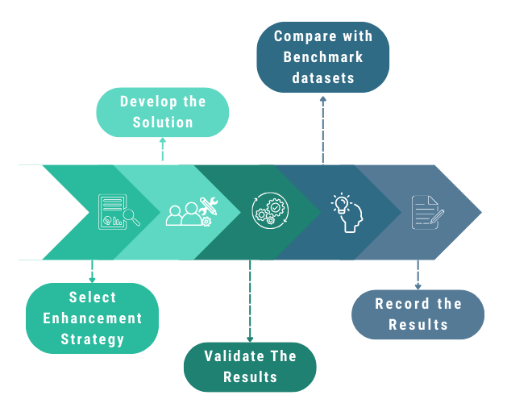

# Research Proposal: Human-AI Collab: Decision Support

**Student:** 210343P  
**Research Area:** Human-AI Collab: Decision Support  
**Date:** 2025-08-24  

---

## Abstract

This research explores incremental enhancements to the **Explainable Boosting Machine (EBM)** — a state-of-the-art glassbox model developed by Microsoft Research that bridges the gap between accuracy and interpretability in machine learning. While EBMs already deliver competitive performance with black-box models like XGBoost and Random Forest, this work seeks to extend their capabilities across three dimensions: (1) optimized performance through Bayesian hyperparameter tuning, (2) improved fairness via a multi-objective loss function, and (3) enhanced adaptability through self-supervised pretraining. The proposed enhancements will be empirically validated on benchmark datasets such as **Adult Income**, **Heart Disease**, and **Breast Cancer**. The ultimate goal is to strengthen EBM’s role as a reliable, transparent decision-support model for high-stakes domains, contributing to the broader field of **responsible and human-aligned AI**.

---

## 1. Introduction

### The Black-Box Problem in High-Stakes Domains
Modern AI systems have achieved remarkable predictive power but at the cost of **transparency**. Deep neural networks, Random Forests, and gradient boosting models operate as *black boxes*, obscuring the reasoning behind their outputs. This lack of interpretability poses serious challenges in domains such as **medicine, law, and finance**, where decisions must be explainable and accountable. Without transparency, it is difficult to **debug errors, detect bias, ensure fairness**, or meet regulatory standards.

### Post-Hoc vs. Glassbox Interpretability
To address these challenges, **Explainable AI (XAI)** has evolved into two main schools of thought:
- **Post-hoc methods** (e.g., LIME, SHAP) provide explanations *after* training a black-box model but risk generating approximate or misleading explanations.  
- **Glassbox models**, by contrast, are inherently interpretable — their internal logic is fully transparent. Examples include **Linear Models**, **Decision Trees**, and **Generalized Additive Models (GAMs)**.

Glassbox models are preferred in high-stakes applications because they offer *lossless explanations* that directly mirror model behavior.

### Explainable Boosting Machines (EBMs)
The **Explainable Boosting Machine** combines the interpretability of GAMs with the accuracy of ensemble methods. Using techniques such as **cyclic gradient boosting**, **automatic interaction detection**, and **bagging**, EBMs achieve performance competitive with XGBoost and Random Forests. Their additive structure allows for clear visualization of feature contributions, enabling precise local and global interpretability.

---

## 2. Problem Statement

Although EBMs balance interpretability and accuracy effectively, there remains room for **targeted improvements**:
1. Default hyperparameters may not be optimal across all domains.
2. Existing loss functions prioritize accuracy without accounting for fairness.
3. EBMs struggle in low-data (“cold start”) conditions compared to deep-learning counterparts.

This research aims to **incrementally enhance EBM** through optimization, fairness integration, and pretraining — improving its robustness, fairness, and adaptability while maintaining interpretability.

---

## 3. Literature Review Summary

### Generalized Additive Models (GAMs)
EBMs build upon GAMs — statistical models that combine linear interpretability with non-linear flexibility:
$$
g(E[y]) = \beta_0 + \sum_i f_i(x_i)
$$
where \( f_i(x_i) \) models each feature’s contribution independently.

### Evolution to EBMs
EBMs introduce:
- **Cyclic Gradient Boosting** for feature-wise updates  
- **Automatic Interaction Detection** for capturing pairwise effects  
- **Bagging** for stability and variance reduction  

These advancements yield interpretability without sacrificing predictive power.

### InterpretML Framework
**InterpretML**, Microsoft’s open-source toolkit, provides the primary implementation for EBMs, facilitating easy visualization, interpretability, and explainability workflows.

### Benchmark Landscape
Empirical results show that EBMs achieve **AUROC parity** with black-box models on datasets like Adult Income, Heart Disease, and Credit Card Fraud, validating their state-of-the-art status.

| Dataset       | Domain   | Logistic Regression | Random Forest | XGBoost | EBM       |
| ------------- | -------- | ------------------- | ------------- | ------- | --------- |
| Adult Income  | Finance  | 0.907               | 0.903         | 0.927   | **0.928** |
| Heart Disease | Medical  | 0.895               | 0.890         | 0.851   | **0.898** |
| Credit Fraud  | Security | 0.979               | 0.950         | 0.981   | **0.981** |

---

## 4. Research Objectives

### Primary Objective
To enhance the Explainable Boosting Machine (EBM) framework for improved **accuracy, fairness, and robustness** while maintaining interpretability.

### Secondary Objectives
- Implement **Bayesian hyperparameter optimization** for efficient parameter tuning.  
- Develop a **custom multi-objective loss function** that balances predictive accuracy and fairness.  
- Integrate **self-supervised pretraining** to improve performance in low-label regimes.  
- Evaluate model performance on benchmark datasets across multiple domains.

---

## 5. Methodology

### 5.1 Targeted Bayesian Hyperparameter Optimization
Bayesian Optimization will be used to efficiently explore EBM’s parameter space (e.g., learning rate, max leaves, smoothing rounds).  
The objective function:
$$
\text{Objective} = 1 - \text{ROC AUC}
$$
will be minimized using **Optuna**, enabling faster convergence than grid or random search.

### 5.2 Custom Multi-Objective Fairness Loss
A composite loss function will be designed to jointly optimize accuracy and fairness:
$$
L_{total} = \alpha L_{accuracy} + \beta L_{fairness}
$$
where \(L_{fairness}\) penalizes demographic parity or equalized odds violations. The fairness trade-off will be empirically visualized through Pareto fronts.

### 5.3 Self-Supervised Pretraining
A deep autoencoder will be trained on unlabeled data to learn latent feature structures.  
The encoded representations will generate **init_scores** for the EBM, effectively warm-starting it:
$$
\text{init\_scores} = \hat{p}
$$
This pretraining strategy is expected to improve EBM performance in small-labeled datasets.

---

## 6. Expected Outcomes

- **Improved accuracy and robustness** of EBM through Bayesian optimization.  
- **Enhanced fairness** by explicitly incorporating fairness penalties in loss formulation.  
- **Better generalization** in low-label scenarios through self-supervised pretraining.  
- Empirical insights into **accuracy–fairness trade-offs**, supporting responsible AI research.

---

## 7. Timeline

| Week  | Task                                       |
| ----- | ------------------------------------------ |
| 1–2   | Literature Review                          |
| 3–4   | Define methodology and datasets            |
| 5–7   | Baseline EBM training and benchmarking     |
| 8–10  | Implement proposed enhancements            |
| 11–12 | Conduct experiments and collect results    |
| 13–14 | Analyze trade-offs and performance metrics |
| 15–16 | Write and finalize research report         |

---

## 8. Resources Required

- **Datasets:** UCI Adult Income, Heart Disease, Breast Cancer, Credit Card Fraud  
- **Software:** Python 3.10, InterpretML, Optuna, Scikit-learn, Pandas, NumPy, Matplotlib  
- **Hardware:** 16 GB RAM, multicore CPU (no GPU required)  
- **Libraries for Fairness Metrics:** AIF360, Fairlearn  
- **Version Control:** GitHub repository for experiment tracking and documentation  

---

## References

1. Chamola, V. et al. (2023). *A Review of Trustworthy and Explainable AI.* IEEE Access.  
2. Ribeiro, M. et al. (2016). *Why Should I Trust You?* KDD.  
3. Lundberg, S., & Lee, S. (2017). *A Unified Approach to Interpreting Model Predictions.* NeurIPS.  
4. Nori, H. et al. (2019). *InterpretML: A Unified Framework for ML Interpretability.* arXiv:1909.09223.  
5. Ding, J. H. et al. (2021). *Explainable Boosting Machines: A Review.* MDPI Remote Sensing.  
6. Caruana, R. et al. (2015). *Intelligible Models for Healthcare.* KDD.  
7. Hastie, T., & Tibshirani, R. (1986). *Generalized Additive Models.* Statistical Science.  
8. Chen, T., & Guestrin, C. (2016). *XGBoost: A Scalable Tree Boosting System.* KDD.  
9. Agarwal, R. et al. (2020). *Neural Additive Models.* arXiv:2004.13913.  
10. Chang, C. H. et al. (2021). *NODE-GAM: Neural Generalized Additive Model.* ICLR.  
11. Addactis. (2022). *Explainable Boosting Machine: A New Model for Car Insurance.*  
12. Microsoft. (n.d.). *Explainable Boosting Machine Regression.* Microsoft Learn.  

---

**Submission Instructions:**
1. Complete all sections above  
2. Commit your Markdown file to the repository  
3. Create an issue with labels **“milestone”** and **“research-proposal”**  
4. Tag your supervisors for review  
