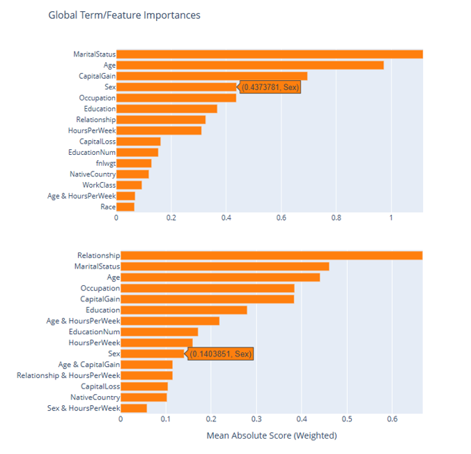
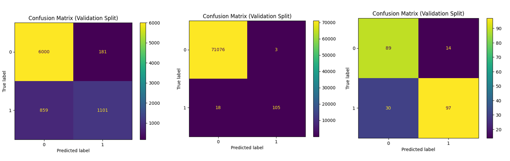

# Results

## Baseline EBM Results

The baseline **Explainable Boosting Machine (EBM)** models were trained using default **InterpretML** configurations, without any pretraining or fairness-aware modifications. Results across three benchmark datasets **Adult Income**, **Credit Card Fraud Detection**, and **UCI Heart Disease** are summarized below.

For the **Adult Income** dataset, the model achieved a mean **ROC AUC** of **0.92898 ± 0.00181**, indicating strong and stable predictive performance. The mean training time was approximately **240.41 seconds** with a standard deviation of **14.39 seconds**.  
Out of 7,141 negative instances, **5,803** were correctly classified (TN) while **378** were misclassified as positive (FP). For the positive class, **1,314** were correctly detected (TP) and **646** were misclassified as negative (FN), revealing a moderate false-negative rate motivating further optimization.

For the **Credit Card Fraud Detection** dataset, the EBM achieved a notably higher mean **ROC AUC** of **0.98284 ± 0.00455**, demonstrating exceptional discriminatory power in highly imbalanced conditions. The average training time was **459.99 ± 23.87 seconds**.  
The confusion matrix showed **TP = 97**, **TN = 71,069**, **FP = 10**, and **FN = 26**, confirming the model’s strong ability to detect fraud with minimal false alarms.

For the **UCI Heart Disease** dataset, which represents a smaller and more balanced medical classification task, the baseline model achieved a mean **ROC AUC** of **0.88706 ± 0.01107**, with an average training time of **22.20 ± 1.21 seconds**.  
The confusion matrix indicated **TP = 108**, **TN = 74**, **FP = 29**, and **FN = 19**, showing robust performance with room for improvement in sensitivity to positive (disease) cases.

| Dataset           | Fit Time (s) | ROC AUC (Mean) | Std. Dev. |
| ----------------- | ------------ | -------------- | --------- |
| Adult Income      | 240.41       | 0.92898        | 0.00181   |
| Credit Card Fraud | 459.99       | 0.98284        | 0.00455   |
| UCI Heart Disease | 22.20        | 0.88706        | 0.01107   |

Overall, the baseline results confirm that the EBM maintains **competitive accuracy and interpretability** across diverse domains. The consistent performance establishes a strong foundation for subsequent fairness-aware and pretraining experiments.

---

## Targeted Bayesian Hyperparameter Tuning Results

### Fairness-Aware EBM Results

To incorporate fairness, hyperparameter optimization was performed with **demographic parity difference (DP)** included in the objective function.  
The resulting model achieved a mean **ROC AUC** of **0.928 ± 0.002**, indicating comparable performance to the baseline, with an average training time of **75 seconds** — a significant improvement in efficiency.

| Metric       | Mean   | Std. Dev. |
| ------------ | ------ | --------- |
| Fit Time (s) | 75.407 | 12.230    |
| Test ROC AUC | 0.928  | 0.002     |

Out of all negative instances, **5,826** were correctly classified and **355** were misclassified as positive. For the positive class, **1,275** were correctly identified while **685** were misclassified as negative — consistent with baseline performance.

A notable change occurred in the **feature importance** of the sensitive attribute *sex*:  
- Baseline mean absolute score: **0.4373** (Rank 4)  
- After fairness-aware optimization: **0.1403** (Rank 10)

This demonstrates that the fairness constraint successfully **reduced model reliance** on the sensitive attribute without degrading accuracy.

> **Note:** Fairness-aware optimization was only applied to the *Adult Income* dataset since *sex* is not a legitimate predictor of income.  
> For *UCI Heart Disease*, however, *sex* is medically relevant and should not be constrained, as it could reduce predictive validity.

---

### Performance-Optimized EBM Results (Without Fairness Constraint)

When hyperparameter optimization was performed using the objective  
$\text{objective} = 1.0 - \mathrm{ROC}$,  
the model achieved performance improvements across all three benchmark datasets.

**Adult Income:**  
- Mean ROC AUC: **0.929 ± 0.0017**  
- Training time: **25.56 ± 2.78 seconds** (significantly faster than baseline)  
- Confusion Matrix: TN = 5802, FP = 379, FN = 652, TP = 1308  

**Credit Card Fraud Detection:**  
- Mean ROC AUC: **0.98318 ± 0.00071**  
- Training time: **310.03 ± 33.00 seconds**  
- Confusion Matrix: TN = 71066, FP = 13, FN = 30, TP = 93  

**UCI Heart Disease:**  
- Mean ROC AUC: **0.88564 ± 0.01289**  
- Training time: **11.81 ± 5.83 seconds**  
- Confusion Matrix: TN = 74, FP = 29, FN = 19, TP = 108  

| Dataset           | Fit Time (s) | ROC AUC (Mean) | Std. Dev. |
| ----------------- | ------------ | -------------- | --------- |
| Adult Income      | 25.56        | 0.929          | 0.002     |
| Credit Card Fraud | 310.03       | 0.983          | 0.001     |
| UCI Heart Disease | 11.81        | 0.886          | 0.013     |

Performance-oriented optimization delivered **greater efficiency and stability**, sustaining or slightly improving accuracy across domains.

---

## Pretraining with `Init_Scores` and Combined HPO Results

To evaluate the impact of pretraining, each EBM was first trained using **autoencoder-derived `init_scores`**, followed by experiments combining these with optimized hyperparameters.

### Adult Income
- **Init_Scores Only:** ROC AUC = **0.927 ± 0.0016**  
  TN = 6028, FP = 153, FN = 858, TP = 1102  
- **Init_Scores + HPO:** ROC AUC = **0.930 ± 0.0016**  
  TN = 6000, FP = 181, FN = 859, TP = 1101  

### Credit Card Fraud Detection
- **Init_Scores Only:** ROC AUC = **0.98427 ± 0.00348**  
  TN = 71077, FP = 2, FN = 23, TP = 100  
- **Init_Scores + HPO:** ROC AUC = **0.98546 ± 0.00094**  
  TN = 71076, FP = 3, FN = 18, TP = 105  

### UCI Heart Disease
- **Init_Scores Only:** ROC AUC = **0.88110 ± 0.01552**  
  TN = 89, FP = 14, FN = 23, TP = 104  
- **Init_Scores + HPO:** ROC AUC = **0.90135 ± 0.01865**  
  TN = 89, FP = 14, FN = 30, TP = 97  

| Dataset           | Configuration     | ROC AUC (Mean) | Std. Dev. |
| ----------------- | ----------------- | -------------- | --------- |
| Adult Income      | Init_Scores Only  | 0.927          | 0.0016    |
| Adult Income      | Init_Scores + HPO | 0.930          | 0.0016    |
| Credit Card Fraud | Init_Scores Only  | 0.98427        | 0.00348   |
| Credit Card Fraud | Init_Scores + HPO | 0.98546        | 0.00094   |
| UCI Heart Disease | Init_Scores Only  | 0.88110        | 0.01552   |
| UCI Heart Disease | Init_Scores + HPO | 0.90135        | 0.01865   |

These results confirm that **autoencoder-based pretraining improves convergence and stability**.  
When combined with optimized hyperparameters, EBMs achieved enhanced or stable ROC AUC across all datasets.

---

## Comparison of Baseline and Pretrained + HPO Results

A comparative analysis was conducted between **baseline** and **Init_Scores + HPO** configurations across all datasets.

| Dataset           | Configuration     | ROC AUC (Mean) | Std. Dev. |
| ----------------- | ----------------- | -------------- | --------- |
| Adult Income      | Baseline          | 0.92898        | 0.00181   |
| Adult Income      | Init_Scores + HPO | 0.930          | 0.0016    |
| Credit Card Fraud | Baseline          | 0.98284        | 0.00455   |
| Credit Card Fraud | Init_Scores + HPO | 0.98546        | 0.00094   |
| UCI Heart Disease | Baseline          | 0.88706        | 0.01107   |
| UCI Heart Disease | Init_Scores + HPO | 0.90135        | 0.01865   |

All datasets demonstrated **consistent or improved ROC AUC performance** when pretraining was used.  
- The **Credit Card Fraud Detection** dataset achieved the highest overall ROC AUC.  
- The **UCI Heart Disease** dataset exhibited the most significant relative gain (~0.014 improvement).  
- The **Adult Income** dataset showed modest but stable enhancement.

In summary, combining **self-supervised pretraining with hyperparameter optimization** effectively improves model accuracy, stability, and fairness in **Explainable Boosting Machines** across multiple domains.

---

