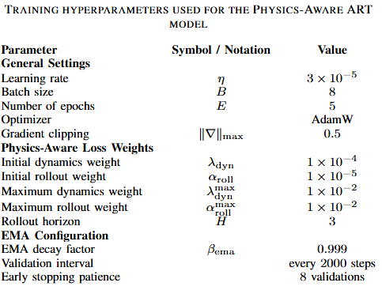

# Training and Experimentation

This document explains the **data flow**, **loss design**, **scheduling**, **EMA**, **validation / checkpointing**, and **practical tips** used in training PA-ART.

---

## 1) Overview

PA-ART augments a Transformer-based sequence model with **physics-aware regularization** so that predicted actions induce **dynamically consistent** state transitions under orbital mechanics. The **total training loss** blends *imitation* and *physics* terms:

$\mathcal{L}$ = $\mathcal{L}$<sub>${\text{imit}}$</sub> + $\lambda_{\text{dyn}}$ $\mathcal{L}{\text{dyn}}$ + $\alpha_{\text{roll}}$ $\mathcal{L}_{\text{roll}}$

- **$\mathcal{L}_{\text{imit}}$** - state & action imitation losses (supervision from convex-optimal trajectories).
- **$\mathcal{L}_{\text{dyn}}$** - one-step physics loss: next state from applying **predicted control** to the **true current state** via the dynamics operator $f$.
- **$\mathcal{L}_{\text{roll}}$** - multi-step rollout loss over horizon \\(H\\): enforces long-horizon consistency by repeatedly propagating with predicted controls.

Two scalars $\lambda_{\text{dyn}}$ and $\alpha_{\text{roll}}$ schedule the strength of physics regularization during training.

---

## 2) Data Pipeline

**Inputs per trajectory (length $T$)**
- `states` $x_{1:T}$ - 6-D RTN (or ROE mapped to RTN) states.
- `actions` $u_{1:T}$ - 3-D Δv in RTN.
- `rtg`, `ctg` - reward-to-go and constraint-to-go.
- `oe` - orbital elements of target per step (conditioning for dynamics).
- `dt` - per-trajectory time step (s).
- `t` - integer time indices

**Normalization**  
Data are normalized using precomputed `scaler_stats.npz` or computed from the training split. The same training statistics must be used to normalize **train** and **val**; keep the stats to **denormalize** for metrics/plots if needed.

**Split & batching**
- 90/10 train/val.
- Mini-batches sampled i.i.d.; each batch returns `(s, a, r, c, t, mask, oe, dt)` tensors on the selected device.

---

## 3) Model Forward

Given a batch, the Transformer receives:
```python
s_pred, a_pred = model(
    states=s,
    actions=a,
    returns_to_go=r.unsqueeze(-1),
    constraints_to_go=c.unsqueeze(-1),
    timesteps=t,
    attention_mask=mask,
    return_dict=False
)
```
It predicts:\
Action sequence ( $\hat{u}$<sub>${1:T}$</sub> $\equiv a^{\text{pred}}$)\
Next-state sequence ( $\hat{x}$<sub>${1:T}$</sub> $\equiv s^{\text{pred}}[:, 1:] $)

## 4) Losses
### 4.1 Imitation loss

$\mathcal{L}$<sub>${\text{imit}}$</sub>
= $\sum_{t=1}^{T}$ $(\|x_t - \hat{x}_t\|_2^2 + \|u_t - \hat{u}_t\|_2^2 $)

### 4.2 Physics-Aware Loss

The total training loss combines imitation accuracy with two physics-consistency regularization terms:

$\mathcal{L}$ = $\mathcal{L}_{\text{imit}}$ + $\lambda_{\text{dyn}}$ $\mathcal{L}_{\text{dyn}}$ + $\alpha_{\text{roll}}$ $\mathcal{L}_{\text{roll}}$

where:

- $\mathcal{L}_{\text{imit}}$: Baseline reconstruction loss for state and control matching.  
- $\mathcal{L}_{\text{dyn}}$: One-step **physics-consistency loss**, enforcing the next-state prediction to align with orbital propagation $f(x_t, \hat{u}_t)$.  
- $\mathcal{L}_{\text{roll}}$: Multi-step **rollout consistency loss**, penalizing long-horizon deviations.

#### Physics-Consistency Loss
At each timestep, the predicted control $\hat{u}_t$ is applied to the true current state $x_t$ through the analytical dynamics model $f(\cdot)$:
\[
$x_{t+1}^{\text{phys}}$ = $f(x_t, \hat{u}_t)$
\]
The loss measures deviation between the physically propagated state and the ground truth:
\[
$\mathcal{L}_{\text{dyn}}$ = 
$\frac{1}{T-1}\sum_{t=1}^{T-1}$ 
$\|x_{t+1} - f(x_t, \hat{u}_t)\|_2^2$
\]
This ensures that the Transformer’s predicted controls generate dynamically consistent transitions under orbital mechanics.

#### Rollout Consistency Loss
To improve long-horizon stability, predicted control sequences are recursively applied over a horizon of $H$ steps: $x_{t+k+1}^{\text{phys}} = f(x_{t+k}^{\text{phys}}, \hat{u}_{t+k})$, 
$[k = 0, 1, \dots, H-1]$ and compared against ground-truth rollouts: $\mathcal{L}_{\text{roll}} = \sum_{k=0}^{H-1} \|x_{t+k+1} - x_{t+k+1}^{\text{phys}}\|_2^2$

This penalizes accumulated drift, encouraging physically feasible control trajectories over extended horizons.

#### Progressive Weight Scheduling
The loss coefficients are gradually increased during training:

$\begin{aligned}
\lambda_{\text{dyn}} &\leftarrow 
\min(\lambda_{\text{dyn}} \times 10, 
\lambda_{\text{dyn}}^{\max})\\
\alpha_{\text{roll}} &\leftarrow 
\min(\alpha_{\text{roll}} \times 10, 
\alpha_{\text{roll}}^{\max})
\end{aligned}$

This incremental schedule allows the model to first learn data-driven behavior before emphasizing physics constraints, preventing unstable optimization early in training.

## 5. Experimental Setup

### 5.1 Evaluation Metrics
- **Mean Squared Error (MSE):** Measures reconstruction accuracy of states and controls.  
- **Physics Residual ($L_{\text{dyn}}$):** Quantifies physical consistency under orbital equations.  
- **Rollout Drift:** Measures cumulative trajectory deviation over long horizons.

### 5.2 EMA 
To enhance training stability, an *Exponential Moving Average (EMA)* of the model parameters was maintained throughout training. 
After each optimization step, the EMA parameters were updated according to:\
$\theta_{\mathrm{ema}}$ $\leftarrow$ 
$\text{decay}\,\theta_{\mathrm{ema}}$ + $(1 - \text{decay})\theta$
where $\theta$ denotes the current model parameters and $\text{decay}$ in $[0,1)$ is a smoothing coefficient (typically close to~1).

### 5.3 Training
A dataset of 100,000 samples was generated, and both baseline model and the Physics-aware model were trained on the same dataset. Both models were trained for 5 epochs.


