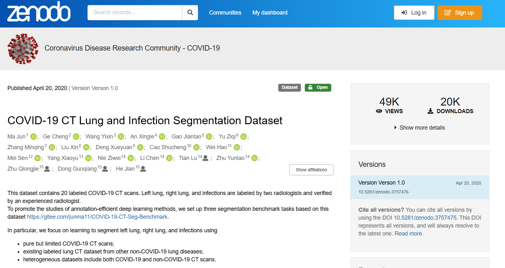
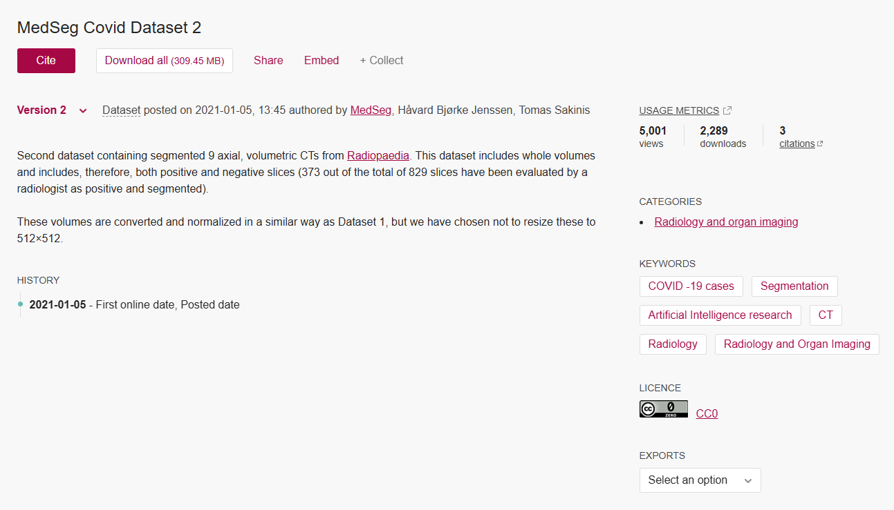

# Data Sources

1. **COVID-19 CT Lung and Infection Segmentation Dataset** : labeled CT scans with lung and infection masks; radiologist-verified segmentations.
   ([See dataset](https://zenodo.org/records/3757476))

   

   *Fig 1: Screenshot from zenodo where dataset is published*
2. **MedSeg Covid Dataset 2** : labeled axial volumetric CTs (Radiopaedia origin), with positive/negative slices annotated by a radiologist.
   ([See dataset](https://figshare.com/articles/dataset/Covid_Dataset_2/1352150))

   

   *Fig 2: Screenshot from figshare where dataset is published*

# Data Description

* **Format:** Volumetric CT scans (NIfTI) converted to 2D axial slices.
* **Labels:** Binary labels per slice (COVID vs non-COVID); segmentation masks available (left lung, right lung, infections) for a subset / for ROI extraction.
* **Class distribution (raw):** 1,724 COVID, 885 non-COVID (imbalance addressed via augmentation).
* Final sets used in experiments:
  * Training (after augmentation & balancing): **5,000 images** (2,500 COVID, 2,500 non-COVID)
  * Validation (held out, cleaned): **701 images** (486 COVID, 215 non-COVID)
