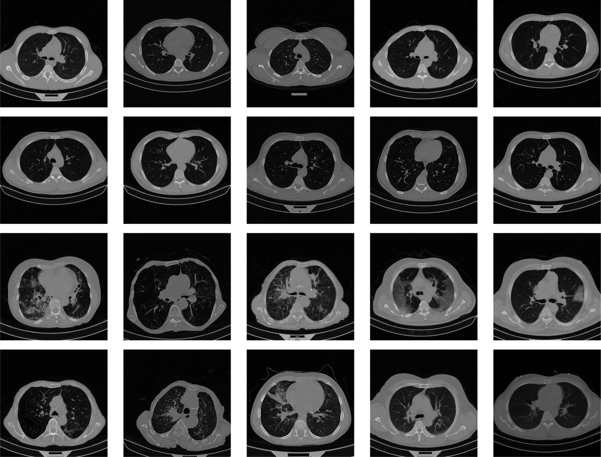

# Literature Review: Healthcare AI:Medical Imaging

**Student:** 210471F

**Research Area:** Healthcare AI:Medical Imaging

**Date:** 2025-09-12

## Abstract

This literature review examines the application of artificial intelligence, particularly deep learning, in medical imaging with a focus on CT-based diagnostics. Key areas reviewed include early convolutional neural network (CNN) approaches, transfer learning with ResNet/DenseNet, hybrid and attention-based architectures, and recent innovations such as Vision Transformers (ViTs) and multi-branch models. While earlier studies established proof-of-concept, they often lacked clinical robustness. More recent research emphasizes domain-specific preprocessing, advanced augmentation, and architectural enhancements to address subtle pathological features. Gaps remain in dataset availability, generalizability across institutions, and clinical validation.

## 1. Introduction

Medical imaging plays a central role in clinical diagnosis, particularly for diseases such as COVID-19, lung cancer, and chronic obstructive pulmonary disease (COPD). With the limitations of manual interpretation, AI-driven methods have emerged to automate and enhance detection, classification, and prognosis. Also. analyzing CT scans is a time-consuming task that demands specialized medical expertise, creating a significant bottleneck, particularly in overburdened healthcare systems or underdeveloped regions. As shown in Figure 1, the CT scans of COVID-19 and non-COVID patients show no obvious differences that can be identified without expert assessment.

  *Fig. 1. Examples of CT scans, first two rows contain images from healthy subjects, whereas the last two rows contain images from COVID-19 patients.*

This review focuses on deep learning in CT imaging, highlighting research directions, methodological innovations, and challenges that shaped the development of our multi-branch ConvNeXt architecture.

## 2. Search Methodology

### 2.1. Search Terms Used

#### General AI & Imaging Terms

* Artificial Intelligence in Healthcare
* Deep Learning in Medical Imaging
* Computer Vision in Medicine
* CT Scan Analysis AI
* Medical Image Classification
* Radiology AI

#### Specific to Architectures & Methods

* Convolutional Neural Networks (CNNs)
* Transfer Learning in Medical Imaging
* Vision Transformers (ViTs) in Healthcare
* Attention Mechanisms in Imaging AI
* Multi-branch Neural Networks
* Data Augmentation for CT Imaging

#### Application-Specific Terms

* COVID-19 CT Diagnosis AI
* Lung Cancer Detection from CT Scans
* Pulmonary Disease Prediction AI
* Ground-glass Opacity Detection AI
* Automated Radiology Diagnosis

### 2.2. Databases Searched

- [X] IEEE Xplore
- [X] ACM Digital Library
- [X] Google Scholar
- [X] ArXiv
- [X] Other: PubMed

### 2.3. Time Period

2017–2025, with earlier years (2017–2019) emphasizing architectural and methodological foundations, and more recent years (2020–2025) focusing on COVID-19, related applications and domain-specific advances.

## 3. Key Areas of Research

### 3.1. CNN-Based and Transfer Learning Models

Early research applied CNNs and transfer learning using architectures like ResNet and DenseNet for tasks such as hemorrhage detection, lung nodule classification, and COPD prognosis.

**Key Papers:**

- *Grewal et al. (2018)*: Proposed the RADnet model by integrating DenseNet with a recurrent neural network layer, achieving 81.82% accuracy in hemorrhage prediction from brain CT scans.[1]
- *Song et al. (2017)*: Developed CNN, DNN, and SAE models for lung cancer classification, with the CNN achieving the highest accuracy.[2]
- *Gonzalez et al. (2018)*: Applied CNN-based analysis to identify and stage COPD and predict ARD occurrences and mortality risks in smokers.[3]

> Early CT diagnostic models mainly relied on conventional CNN architectures. For classification tasks, transfer learning using ResNet- and DenseNet-based networks showed promising results.[4] However, directly using models pre-trained on natural images in the medical imaging domain proved difficult due to differences in image characteristics, such as lower contrast, noise, and artifacts, which limit tissue representation. This challenge highlighted the need for domain-specific model adaptations.

### 3.2. COVID-19 CT Diagnosis and Hybrid Architectures

During the COVID-19 pandemic, rapid and accurate screening prompted research on automating diagnosis from chest CT images. Key indicators include ground-glass opacities, consolidation, reticular patterns, and crazy paving patterns.[5] Studies also examined the link between these CT findings and clinical manifestations.[6] Early detection efforts used pre-trained CNNs such as ResNet50, DenseNet169, EfficientNetB1, and VGG16, showing deep learning’s potential but often lacking clinical robustness. This highlighted the need to refine these models with modern techniques for state-of-the-art performance.[7] Later approaches integrated GANs for augmentation, multimodal fusion, and attention mechanisms.

**Key Papers:**

- *H. P. Sahu and R. Kashyap* *(2023)*: Proposed a Fine_DenseNet model with IGAN_AHb, optimized via the Artificial Hummingbird algorithm, for multi-class COVID-19 detection from chest CT images, achieving 95.73% accuracy.[8]
- *N. Ghassemi et al.* *(2023)*: Used pre-trained deep neural networks with CycleGAN-based data augmentation for accurate COVID-19 detection from CT images, providing interpretability via Grad-CAM and reliability assessment.[9]
- *K. Amuda et al.* *(2025)* : Proposed the ViTGNN hybrid model combining CNNs, GNNs, and Vision Transformers for COVID-19 detection from CT scans, achieving 95.98% accuracy and high overall diagnostic performance.[10]
- *B. Kaushik et al.* *(2025)*: Proposed a three-layer stacked multimodal framework using eight pre-trained models for feature extraction from large COVID-19 chest X-ray datasets, achieving high diagnostic performance with 95.79% accuracy.[11]

### 3.3. Attention and Multi-Branch Architectures

Recent innovations leverage attention-based pooling and multi-branch pipelines to capture subtle pathological cues, addressing limitations of traditional CNNs.

Key Papers:

- *Woo et al. (2018)*: CBAM module introduced attention mechanisms in CNNs.[12]
- *Zheng et al. (2022)*: Proposed the MA-Net using mutex and fusion attention blocks with an adaptive weight multiloss function for COVID-19 diagnosis from CT images, achieving 98.17% accuracy, 97.25% specificity, and 98.79% sensitivity.[13]
- *Hang Yang et al. (2022)*: Proposed CovidViT, a transformer-based model with self-attention for COVID-19 detection from chest X-rays, outperforming other deep learning models, with an online diagnostic system also developed.[14]
- ***Current work (2025)***: Multi-branch ConvNeXt architecture with global average pooling, max pooling, and attention-weighted pooling, achieving ROC-AUC 0.9937 and accuracy 0.9757[15]

## 4. Research Gaps and Opportunities

### Gap 1: Limited Dataset Availability

**Why it matters:** AI models require large, diverse datasets for generalization. Current datasets are small and fragmented due to privacy constraints.

**How your project addresses it:** Combined multiple datasets and applied robust augmentation to expand training size and balance classes.
For this study, two contemporary and higher-quality datasets from [16] and [17], were utilized to build a robust training and validation set.

- **COVID-19 CT Lung and Infection Segmentation Dataset**: This dataset contains 20 labeled COVID-19 CT scans. Left lung, right lung, and infections are labeled by two radiologists and verified by an experienced radiologist.[16]
- **MedSeg Covid Dataset 2**: This contains 9 labeled axial volumetric CTs from Radiopaedia. Both positive and negative slices (373 out of the total of 829 slices have been evaluated by a radiologist as positive and segmented).[17]

### Gap 2: Lack of Fine-Grained Feature Extraction

**Why it matters:** Subtle features (e.g., ground-glass opacities) are easily missed by standard CNNs.

**How your project addresses it:** Introduced an attention-weighted pooling branch alongside global average and max pooling to capture both global and subtle local features.

## 5. Theoretical Framework

The theoretical foundation of the presented research is centered on the ConvNeXt architecture, a modern convolutional network that incorporates design principles from Vision Transformers while retaining the efficiency and inductive biases of traditional CNNs. This architecture provides a robust backbone for the model, leveraging weights pre-trained on the massive ImageNet dataset. The underlying principle is transfer learning, which posits that a model trained on a large, general-purpose dataset can learn a powerful set of low-level and high-level features that can then be "transferred" to a new, more specific task with minimal training.

The core theoretical contribution of the project lies in its novel multi-branch architecture. This design is a conceptual extension of transfer learning, aimed at enriching the feature representation beyond what a single-branch network can achieve. The three parallel branches process the base features from the ConvNeXt backbone in distinct ways to capture a comprehensive understanding of the input image :

- **Global Average Pooling Branch**: This pathway condenses the feature maps into a single vector, capturing a holistic view of the image's overall context and general texture.
- **Global Max Pooling Branch**: This branch identifies the most salient or prominent features, which is particularly useful for detecting strong signals such as large, high-intensity lesions that may indicate severe pathology.
- **Attention-weighted Pooling Branch**: This is the most innovative component of the framework. It operates by learning a dynamic attention mask that is multiplied with the feature maps, effectively weighting the importance of each feature channel and spatial location. This design compels the model to learn where to "look" for critical clinical markers, such as subtle ground-glass opacities, which is a significant factor in its superior performance. This mechanism also offers a form of implicit Explainable AI (XAI), as it indicates which regions of the image the model considers most diagnostically relevant, addressing the broader need for transparency and trustworthiness in clinical AI systems

## 6. Methodology Insights

A critical finding from the reviewed literature is that high performance in medical imaging AI is not achieved by model architecture alone but by a meticulously planned end-to-end pipeline. The project's methodology provides several key insights into this holistic approach.

One major insight is the power of robust data augmentation to solve common challenges in medical datasets. The raw, combined dataset had a significant class imbalance between COVID-19 and non-COVID cases. The comprehensive augmentation pipeline, which included a variety of transformations like rotation, flipping, and noise addition, successfully balanced the dataset, obviating the need for specialized loss functions like Focal Loss. This simplification allowed for the use of a standard binary cross-entropy loss, resulting in a more reliable and robust model. The high F1-score achieved by the final model is a direct consequence of this careful balancing, demonstrating its ability to make accurate predictions for both classes.  

Another crucial methodological insight is the effectiveness of a two-phase training strategy to optimize transfer learning. The first phase involved training only the newly added classification head while keeping the pre-trained ConvNeXt base frozen. This allowed the new layers to quickly learn how to interpret the features extracted by the backbone, preventing "catastrophic forgetting" of the general visual features learned from ImageNet. The second phase then fine-tuned a portion of the base model with a much lower learning rate. This step was critical for adapting the model's weights to the unique visual patterns of CT scans, enabling it to learn subtle, domain-specific features of pulmonary pathologies without overfitting. This structured approach ensures both training efficiency and a high degree of specialization for the final task.

## 7. Conclusion

The research presented successfully demonstrates a multi-faceted approach to automated COVID-19 diagnosis from CT scans. The literature review has established that while early deep learning models were foundational, they often lacked the clinical robustness and generalizability required for real-world application. Subsequent advancements have trended toward hybrid and multi-modal architectures to address these limitations.

The proposed project, featuring a novel multi-branch ConvNeXt architecture and a rigorous end-to-end training pipeline, represents a significant step forward. It directly addresses the identified research gaps by:

1. Enhancing clinical robustness and generalizability through the strategic combination of data from two distinct sources.
2. Bridging the gap between natural image pre-training and medical domain specifics through meticulous preprocessing (CLAHE and ROI extraction) and a novel attention-weighted pooling branch.

The principles of this multi-faceted approach, including advanced preprocessing, architectural enhancements, and a structured training regimen, are broadly applicable to a wide range of medical image classification challenges beyond COVID-19. Future work should explore the integration of multi-modal data, such as fusing CT scans with Electronic Health Records (EHR) and wearable device data, to further improve diagnostic accuracy. Additionally, there is a continued opportunity to investigate frameworks that provide more explicit explainability, which is paramount for fostering clinical trust and ensuring the safety of AI-driven medical decisions.  

## References

<small>
[1] M. Grewal, M. M. Srivastava, P. Kumar, and S. Varadarajan, “RADnet: Radiologist level accuracy using deep learning for hemorrhage detection in CT scans,” in 2018 IEEE 15th International Symposium on Biomedical Imaging (ISBI 2018), Apr. 2018, pp. 281–284. doi: 10.1109/ISBI.2018.8363574.

<small>[2] Q. Song, L. Zhao, X. Luo, and X. Dou, “Using Deep Learning for Classification of Lung Nodules on Computed Tomography Images,” J Healthc Eng, vol. 2017, p. 8314740, 2017, doi: 10.1155/2017/8314740.</small>

<small>[3] G. González et al., “Disease Staging and Prognosis in Smokers Using Deep Learning in Chest Computed Tomography,” Am J Respir Crit Care Med, vol. 197, no. 2, pp. 193–203, Jan. 2018, doi: 10.1164/rccm.201705-0860OC.</small>

<small>[4] Y.-M. Chen, Y. J. Chen, W.-H. Ho, and J.-T. Tsai, “Classifying chest CT images as COVID-19 positive/negative using a convolutional neural network ensemble model and uniform experimental design method,” BMC Bioinformatics, vol. 22, no. 5, p. 147, Nov. 2021, doi: 10.1186/s12859-021-04083-x.</small>

<small>[5] Z. Ye, Y. Zhang, Y. Wang, Z. Huang, and B. Song, “Chest CT manifestations of new coronavirus disease 2019 (COVID-19): a pictorial review,” Eur Radiol, vol. 30, no. 8, pp. 4381–4389, Aug. 2020, doi: 10.1007/s00330-020-06801-0.</small>

<small>[6] “Relation Between Chest CT Findings and Clinical Conditions of Coronavirus Disease (COVID-19) Pneumonia: A Multicenter Study - PubMed.” Accessed: Sept. 06, 2025. [Online]. Available: https://pubmed.ncbi.nlm.nih.gov/32125873/</small>

<small>[7] X. (Freddie) Liu, G. Karagoz, and N. Meratnia, “Analyzing the Impact of Data Augmentation on the Explainability of Deep Learning-Based Medical Image Classification,” Machine Learning and Knowledge Extraction, vol. 7, no. 1, p. 1, Mar. 2025, doi: 10.3390/make7010001.</small>

<small>[8] H. P. Sahu and R. Kashyap, “Fine Denseiganet: Automatic Medical Image Classification in Chest CT Scan Using Hybrid Deep Learning Framework,” International Journal of Image and Graphics, July 2023, doi: 10.1142/S0219467825500044.</small>

<small>[9] N. Ghassemi et al., “Automatic diagnosis of COVID-19 from CT images using CycleGAN and transfer learning,” Applied Soft Computing, vol. 144, p. 110511, Sept. 2023, doi: 10.1016/j.asoc.2023.110511.</small>

<small>[10] K. Amuda, A. Wakili, T. Amoo, L. Agbetu, Q. Wang, and J. Feng, “Detecting SARS-CoV-2 in CT Scans Using Vision Transformer and Graph Neural Network,” Algorithms, vol. 18, no. 7, p. 413, July 2025, doi: 10.3390/a18070413.</small>

<small>[11] B. Kaushik, A. Chadha, A. Mahajan, and M. Ashok, “A three layer stacked multimodel transfer learning approach for deep feature extraction from Chest Radiographic images for the classification of COVID-19,” Engineering Applications of Artificial Intelligence, vol. 147, p. 110241, May 2025, doi: 10.1016/j.engappai.2025.110241.</small>

<small>[12] S. Woo, J. Park, J.-Y. Lee, and I. S. Kweon, “CBAM: Convolutional Block Attention Module,” July 18, 2018, arXiv: arXiv:1807.06521. doi: 10.48550/arXiv.1807.06521.</small>

<small>[13] B. Zheng, Y. Zhu, Q. Shi, D. Yang, Y. Shao, and T. Xu, “MA-Net:Mutex attention network for COVID-19 diagnosis on CT images,” Appl Intell, vol. 52, no. 15, pp. 18115–18130, Dec. 2022, doi: 10.1007/s10489-022-03431-5.</small>

<small>[14] H. Yang, L. Wang, Y. Xu, and X. Liu, “CovidViT: a novel neural network with self-attention mechanism to detect Covid-19 through X-ray images,” Int. J. Mach. Learn. & Cyber., vol. 14, no. 3, pp. 973–987, Mar. 2023, doi: 10.1007/s13042-022-01676-7.</small>

<small>[15] I. Perera and U. Thayasivam, “A Novel Multi-branch ConvNeXt Architecture for Identifying Subtle Pathological Features in CT Scans,” Oct. 10, 2025, arXiv: arXiv:2510.09107. doi: 10.48550/arXiv.2510.09107.
</small>

<small>[16] M. Jun et al., “COVID-19 CT Lung and Infection Segmentation Dataset.” Zenodo, Apr. 20, 2020. Accessed: Sept. 04, 2025. [Online]. Available: https://zenodo.org/records/3757476</small>

<small>[17] “MedSeg Covid Dataset 2.” figshare, Jan. 05, 2021. doi: 10.6084/m9.figshare.13521509.v2.</small>
