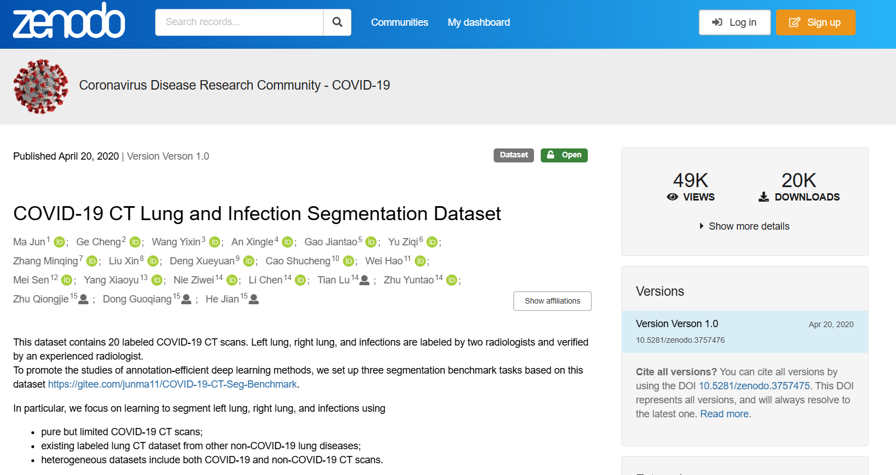
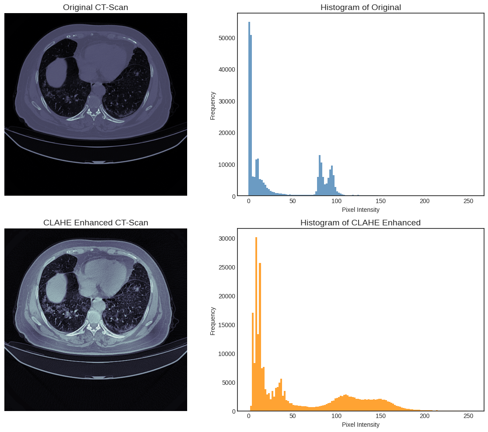
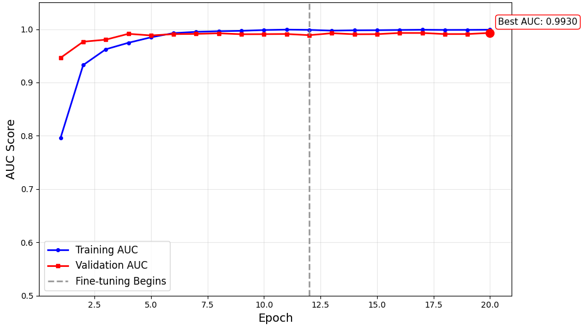

# Methodology: Healthcare AI:Medical Imaging

**Student:** 210471F

**Research Area:** Healthcare AI:Medical Imaging

**Date:** 2025-09-15

## 1. Overview

This methodology describes an end-to-end pipeline for binary classification of CT slices (COVID-19 vs non-COVID) using a novel **multi-branch ConvNeXt** architecture. The pipeline covers data acquisition (two public CT datasets), volumetric-to-slice processing, ROI (two-lung) extraction, CLAHE enhancement, a comprehensive augmentation and class-balancing strategy, a ConvNeXtSmall backbone extended with three parallel pooling branches (Global Average, Global Max, Attention-Weighted Pooling), and a disciplined two-phase transfer-learning training regimen with checkpointing and learning-rate scheduling. Evaluation uses stratified train/validation splitting and standard classification metrics (AUC, F1, precision, recall, accuracy, loss).

## 2. Research Design

The research design is a rigorous, end-to-end deep learning pipeline. It starts with data acquisition and meticulous preprocessing, including image enhancement and region of interest extraction to isolate the lungs. A data augmentation pipeline is used to address class imbalance and expand the dataset. The core of the research is the development and implementation of a multi-branch ConvNeXt architecture. The model is trained using a two-phase transfer learning strategy and evaluated on a combined dataset to ensure generalizability. The final performance is assessed using a suite of metrics beyond simple accuracy to provide a robust evaluation.

## 3. Data Collection

### 3.1 Data Sources

1. **COVID-19 CT Lung and Infection Segmentation Dataset** : labeled CT scans with lung and infection masks; radiologist-verified segmentations.
   ([See dataset](https://zenodo.org/records/3757476))

   

   *Fig 1: Screenshot from zenodo where dataset is published*
2. **MedSeg Covid Dataset 2** : labeled axial volumetric CTs (Radiopaedia origin), with positive/negative slices annotated by a radiologist.
   ([See dataset](https://figshare.com/articles/dataset/Covid_Dataset_2/1352150))

   

   *Fig 2: Screenshot from figshare where dataset is published*

### 3.2 Data Description

* **Format:** Volumetric CT scans (NIfTI) converted to 2D axial slices.
* **Labels:** Binary labels per slice (COVID vs non-COVID); segmentation masks available (left lung, right lung, infections) for a subset / for ROI extraction.
* **Class distribution (raw):** 1,724 COVID, 885 non-COVID (imbalance addressed via augmentation).
* Final sets used in experiments:
  * Training (after augmentation & balancing): **5,000 images** (2,500 COVID, 2,500 non-COVID)
  * Validation (held out, cleaned): **701 images** (486 COVID, 215 non-COVID)

### 3.3 Data Preprocessing

*Fig 3: Pre-processing steps done for the CT scans*

As shown in the Figure 3, all preprocessing steps below, were applied deterministically to each volumetric input:

1. **Load volumetric NIfTI** and convert to a 3D image array.
2. **Orientation correction / rotation** to canonical orientation (ensures consistent anatomical axes).
3. **Slice selection:** keep slices from **20% to 80%** of the scan depth to discard top/bottom slices that rarely contain meaningful lung anatomy.
4. **Resize:** every selected slice resized to **512 × 512** pixels.
5. **Normalization:** scale pixel intensities to the **[0, 1]** range.
6. **Contrast enhancement:** apply **CLAHE** (Contrast Limited Adaptive Histogram Equalization) on each slice to increase local contrast and highlight subtle features (e.g., ground-glass opacities) while limiting noise amplification.

   

   *Fig 4: Comparison of original and CLAHE-enhanced CT scans with corresponding histograms*
7. Lung ROI extraction and cropping (two-lung crop + concat):

   * Create a **binary lung mask** (thresholding/morphology on CT intensity or use provided segmentation if available).
   * Find contours and choose the **two largest contours** as left and right lungs.
   * Draw bounding boxes around each lung region.
   * **Crop each lung separately** , resize each crop to **125 × 250** pixels, then **horizontally concatenate** the left and right crops into a single **250 × 250** image. This focuses the model on pulmonary regions and removes extraneous anatomy (ribs, heart, background). (See Figure 5 below.)
   * **Final formatting:** store preprocessed 250 × 250 images (single-channel) for augmentation and model input

  

   *Fig 5: Original CT Scans and Cropped Lung Regions of COVID-19 CT segmentation dataset*

## 4. Model Architecture

**Base backbone:** ConvNeXtSmall pre-trained on ImageNet — used as a feature extractor. The backbone processes the 250×250 input (preprocessed lung concatenation) and outputs high-level feature maps.

**Proposed Multi-branch Head (novel):** three parallel branches applied to the backbone feature maps, followed by fusion and classification

1. **Global Average Pooling (GAP) Branch** : Applies global average pooling to produce a vector summarizing global texture/contextual features.
2. **Global Max Pooling (GMP) Branch** : Applies global max pooling to capture the most salient/high-activation features (e.g., strong lesions).
3. **Attention-weighted Pooling Branch** : Learns a spatial and/or channel attention mask (via lightweight convolution + sigmoid or softmax), multiplies the attention mask with the backbone feature maps to emphasise diagnostically relevant regions, then applies global average pooling to the weighted features.

**Fusion & selection:**

* Concatenate outputs of GAP, GMP and Attention branches into a single feature vector.
* Pass concatenated vector through a **feature selection dense layer** (Dense + sigmoid activation) that learns to weight/attenuate components of the fused representation.

**Classification head:**

* Dense → Normalization → Dropout layers → final Dense with **sigmoid** activation for binary output (single neuron).
* Loss: **Binary Cross-Entropy** (equal class weights because augmentation balances classes).
* Primary optimization objective during training: **ROC-AUC** .

**Design rationale:** combining multiple pooling strategies captures global patterns, prominent local signals, and learned attention foci, together improving detection of subtle CT features.

*Fig 6: Model architecture*

## 5. Experimental Setup

### 5.1 Evaluation Metrics

* **Loss:** Binary cross-entropy (reported final validation loss = **0.0912** ).
* **Area Under ROC Curve (AUC):** primary metric (reported **0.9937** ).
* **Accuracy:** overall correctness (reported **0.9757** ).
* **Precision:** positive predictive value (reported **0.9835** ).
* **Recall (Sensitivity):** true positive rate (reported **0.9815** ).
* **F1-Score:** harmonic mean of precision & recall (reported **0.9825** ).
* **Confusion matrix:** reported for validation (8 false positives, 9 false negatives out of 701).

> (Definitions of metrics and formulas used are standard: Accuracy = (TP+TN)/Total, Precision = TP/(TP+FP), Recall = TP/(TP+FN), F1, FPR etc.)

### 5.2 Baseline Models

Models used as baselines or compared in the results (performance shown in comparative table):

* CNN (8-layers)
* InceptionV3
* EfficientNet
* ResNet
* ResNet + SE (Squeeze-and-Excitation)
* ResNet + CBAM (Convolutional Block Attention Module)
* MTL (Multi-task Learning model)
* MA-Net (Mutex attention network)
* **Ours:** Multi-branch ConvNeXt (MB-ConvNeXt)

| Method                 | Accuracy   | Sensitivity (Recall) | Specificity | AUC        |
| ------------------------ | ------------ | ---------------------- | ------------- | ------------ |
| CNN 8-layers           | 0.7467     | 0.80                 | 0.70        | 0.78       |
| InceptionV3            | 0.8267     | 0.88                 | 0.78        | 0.82       |
| EfficientNet           | 0.9067     | 0.91                 | 0.85        | 0.93       |
| ResNet+SE              | 0.8707     | 0.9322               | 0.8030      | 0.9557     |
| ResNet                 | 0.8890     | 0.9253               | 0.8439      | 0.9649     |
| ResNet+CBAM            | 0.9162     | 0.8808               | 0.9552      | 0.9784     |
| MTL                    | 0.9467     | 0.96                 | 0.92        | 0.97       |
| MA-Net                 | 0.9588     | 0.9512               | 0.9672      | 0.9885     |
| **MB-ConvNeXt (Ours)** | **0.9757** | **0.9815**           | **0.9835**  | **0.9937** |

*Table 1: Performance comparison of different methods*

> **Note:** All comparisons were done on the same dataset. Apart from our model, the performances of other models were recorded according to previous research conducted on this dataset. We did not explicitly try to reproduce all methods but aimed to exceed the state-of-the-art (SOTA) performance.

### 5.3 Hardware/Software Requirements

> **Note:** The original papers did not specify hardware; below are recommended specs to reproduce experiments reliably.

**Hardware (recommended):**

* GPU: single high-memory GPU (≥ 16 GB VRAM) — e.g., NVIDIA RTX 3090 / A5000 / A100; multi-GPU possible for acceleration.
* CPU: modern multi-core CPU (4+ cores)
* RAM: 32+ GB system memory
* Disk: SSD with adequate space for volumetric data and augments (100+ GB recommended)

**Software / Libraries (recommended):**

* Python 3.8+
* Deep learning framework: **TensorFlow 2.x** (ConvNeXt pretrained weights available in this ecosystems)
* nibabel (NIfTI handling), OpenCV / scikit-image (image ops), Albumentations (augmentation pipeline), scikit-learn (metrics & splitting), NumPy, pandas, matplotlib / seaborn for plots.
* Training utilities: model checkpointing, ReduceLROnPlateau, early stopping callbacks.

**Hyperparameters used:**

* Batch size: **32**
* Optimizer: adaptive optimizer (e.g., Adam/AdamW recommended)
* Loss: Binary cross-entropy (equal class weights due to augmentation balancing)
* Phase 1: epochs = **12** , learning rate = **1×10⁻³** , base ConvNeXt **frozen** (only classifier head trained)
* Phase 2: epochs = **8** , learning rate = **1×10⁻⁶** , **half of base layers unfrozen** (fine-tuning)

  

  *Fig 7: Two-phase training strategy*

* Callbacks: save best model by validation loss and AUC; learning-rate reduction on plateau; other callbacks to prevent overfitting (early stopping / patience recommended).

## 6. Implementation Plan

|                              Phase | Tasks (concrete)                                                                                                                                                                                                                                                                                                                                                                                                                                                                                                                                                                                                                                                                     | Duration | Deliverables                                                                |
| -----------------------------------: | -------------------------------------------------------------------------------------------------------------------------------------------------------------------------------------------------------------------------------------------------------------------------------------------------------------------------------------------------------------------------------------------------------------------------------------------------------------------------------------------------------------------------------------------------------------------------------------------------------------------------------------------------------------------------------------- | ---------: | ----------------------------------------------------------------------------- |
|   **Phase 1 : Data preprocessing** | - Acquire both datasets and verify formats; load NIfTI volumes - Orientation correction; slice selection (20–80%)- Resize to 512×512; normalize; apply CLAHE- Lung mask creation, contour extraction, two-lung cropping & concat to 250×250 - Save preprocessed dataset and manifest (paths + labels)                                                                                                                                                                                                                                                                                                                                                                   |  1 weeks | Cleaned, preprocessed dataset (250×250 images)                             |
| **Phase 2 : Model implementation** | - Implement ConvNeXtSmall backbone integration (load pretrained weights) - Implement multi-branch head (GAP, GMP, Attention-weighted pooling) - Implement feature selection dense layer and classification head - Implement training loop, metrics logging, checkpointing callbacks                                                                                                                                                                                                                                                                                                                                                                                   |  2 weeks | Working model code, unit tests for layers, model diagram                    |
|          **Phase 3 : Experiments** | - Build augmentation pipeline (rotation, flips, shifts, gamma, noise) - Balance training set to 2,500 per class (5,000 total) - Train in two phases (frozen → partial unfreeze), tune LR & callbacks - Validate on held-out set, generate performance plots (AUC evolution, ROC, confusion matrix, probability violin) - Experiment with alternative backbones (ResNet, EfficientNet, VGG, InceptionV3, MobileNet) for comparison  - Hyperparameter tuning for each backbone (learning rate schedules, dropout, batch size, optimizer choice, augmentation intensity)  - Benchmark results of each backbone vs our proposed multi-branch architecture |  2 weeks | Trained model weights, experiment logs, performance comparison table, plots |
| **Phase 4 : Analysis & Reporting** | - Quantitative analysis: metrics table, confusion matrix breakdown - Comparative analysis vs baselines  - Qualitative analysis: ROC, AUC evolution, predicted probability distributions, attention maps (from attention branch) - Write final report and prepare figures for presentation                                                                                                                                                                                                                                                                                                                                                                             |   2 week | Final report, presentation slides, reproducible code bundle                 |

Table 2: Implementation plan

## 7. Risk Analysis

**1. Limited dataset size / Domain shift**

* *Risk:* Two merged datasets (~2,609 slices) are relatively small for full clinical generalization; dataset may not represent scanner/hospital variability.
* *Mitigation:* (a) augment with realistic transformations (already applied); (b) seek external validation on other hospital datasets; (c) employ domain-adaptation or fine-tune on small site-specific sets.

**2. Data leakage across slices/patients**

* *Risk:* slice-level splitting may inadvertently place slices from the same patient in both train and validation sets, inflating performance.
* *Mitigation:* perform patient-level split where possible; otherwise clearly document splitting strategy and ensure stratification by patient ID if available.

**3. Overfitting during fine-tuning**

* *Risk:* when unfreezing layers, model can overfit small dataset.
* *Mitigation:* two-phase training (frozen head then partial unfreeze), ReduceLROnPlateau, early stopping, dropout, weight decay, and careful monitoring of validation AUC (used as checkpoint metric).

**4. Masking/ROI extraction errors**

* *Risk:* automated lung mask or contour extraction may fail on atypical scans, leading to incorrect crops.
* *Mitigation:* include sanity checks on bounding boxes (size/position thresholds), fallback to full slice input, and manual spot checks; use provided segmentation masks when available.

**5. Class imbalance / synthetic bias from augmentation**

* *Risk:* synthetic augmented examples could introduce bias or unrealistic features.
* *Mitigation:* use conservative augmentations (rotate, flips, small shifts, gamma correction, low noise). Validate with clinician review of sample augmentations; avoid heavy synthetic generation that changes pathology appearance.

**6. Interpretability & clinical acceptance**

* *Risk:* black-box model outputs may hinder clinician adoption.
* *Mitigation:* expose attention maps, probability distributions, ROC; provide per-case explanations (attention-weighted output visualization) and calibration checks.

**7. Privacy & regulatory concerns**

* *Risk:* patient data handling and possible re-distribution concerns.
* *Mitigation:* strictly anonymize any shared data; store data on secure drives; follow institutional IRB / data-use agreements.

**8. Reproducibility**

* *Risk:* variability due to random seeds, different library versions.
* *Mitigation:* pin random seeds, provide environment specification (conda/requirements.txt or Dockerfile), and publish code with clear instructions.

## 8. Expected Outcomes

**Primary outcomes (empirical):**

* A validated multi-branch ConvNeXt model achieving strong diagnostic performance on held-out validation data: **reported validation AUC = 0.9937, accuracy = 0.9757, F1 = 0.9825, precision = 0.9835, recall = 0.9815, loss = 0.0912** . Confusion matrix: **8 FP, 9 FN** out of 701 validation images.

|     Fig 8: Confusion matrix for validation set |    Fig 9: Predicted probability distributions |
| --- | --- |
|    Fig 10: ROC curve |    Fig 11: AUC evolution plot |

**Contributions:**

* A reproducible preprocessing pipeline (CLAHE + two-lung crop + concatenation) that focuses learning on diagnostic regions.
* A **novel multi-branch pooling head** that fuses global, salient, and attention-weighted features, improving sensitivity to subtle CT pathologies.
* A disciplined two-phase transfer-learning training recipe (frozen head → partial unfreeze) shown to adapt ImageNet features to CT domain without catastrophic forgetting.

**Deliverables:**

* Working codebase for preprocessing, training, evaluation (scripts + environment spec)
* Trained model weights and checkpoints (best by validation AUC)
* Figures for publication/presentation: CLAHE examples, ROI crops, AUC evolution plot, ROC curve, confusion matrix, violin plot of predicted probabilities, attention map visualizations.
* Final report documenting methods, results, and suggested next steps (external validation, larger datasets, hybrid architectures).

## 9. License

This project uses a **dual-license scheme** to clearly separate research outputs from software code.

### 1. Text, Data, Figures, and Methodology
All textual content, pre-processed datasets, figures, and methodological descriptions in this repository are licensed under the
**[Creative Commons Attribution 4.0 International (CC BY 4.0)](https://creativecommons.org/licenses/by/4.0/)** license.

You are free to:
- Share : copy and redistribute the material in any medium or format
- Adapt : remix, transform, and build upon the material for any purpose, even commercially

**Attribution required:** Please cite the original work:

*I. Perera and U. Thayasivam, “A Novel Multi-branch ConvNeXt Architecture for Identifying Subtle Pathological Features in CT Scans,” Oct. 10, 2025, arXiv: arXiv:2510.09107. doi: 10.48550/arXiv.2510.09107.*

### 2. Source Code
All source code (e.g., in `src/` and `experiments/`) is licensed under the **MIT License**.

You are free to:
- Use, copy, modify, merge, publish, distribute, sublicense, and/or sell copies of the software

**Note:** The CC BY 4.0 license does **not** apply to the code; the MIT License governs all software in this repository.
