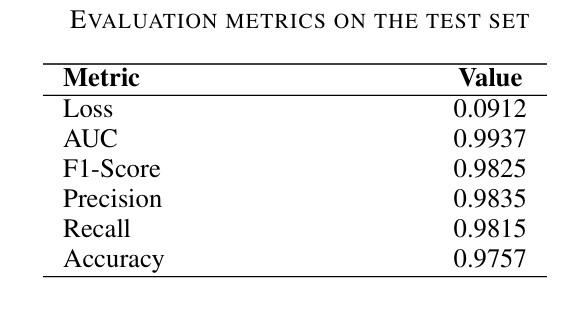
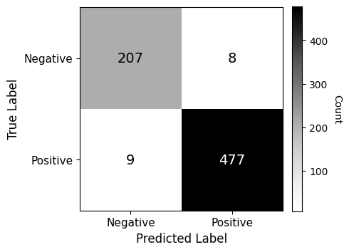
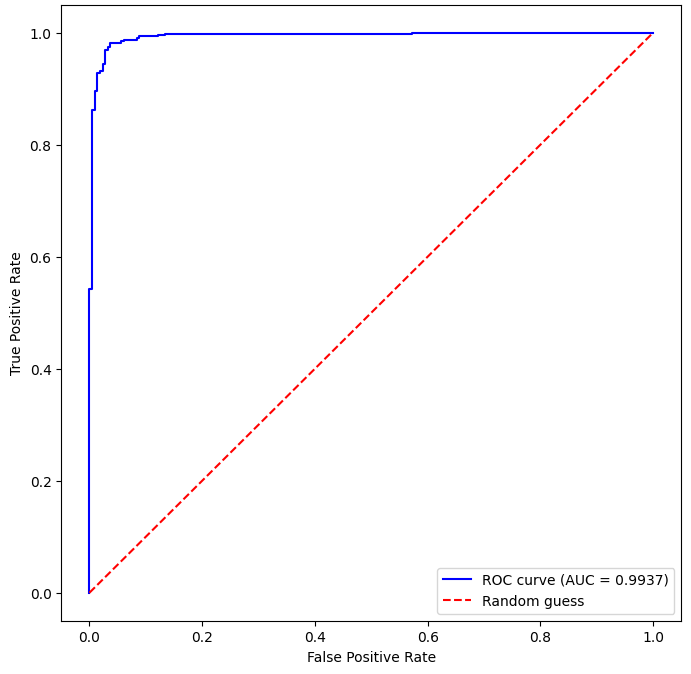
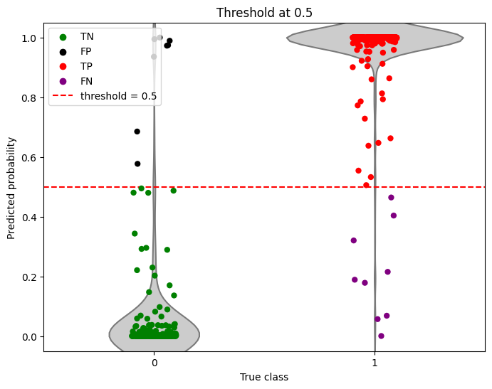
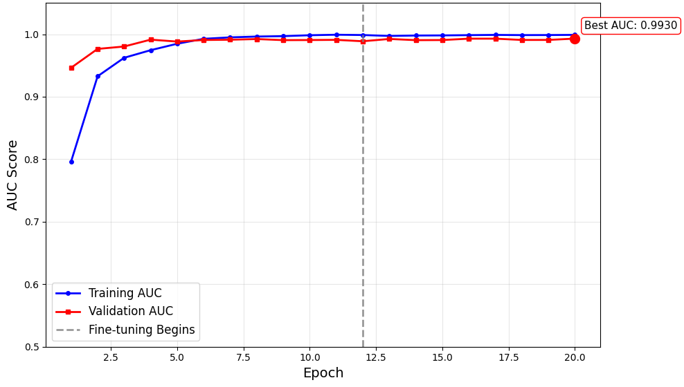
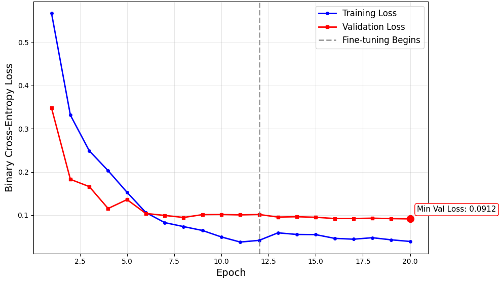
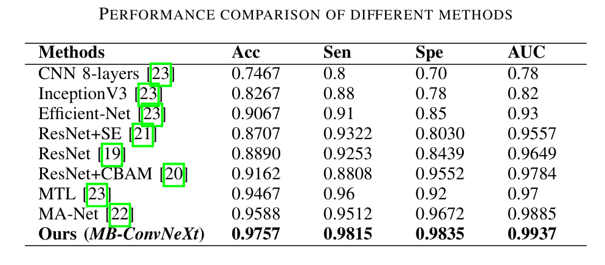

# Results

This contains the experimental results of the proposed multi-branch deep learning architecture for CT scan analysis. The aim was to evaluate the model’s ability to detect subtle pathological features and compare its performance against state-of-the-art baselines.

## Quantitative Results

Final evaluation on the validation set showed strong diagnostic performance:

  
  
<em>Table 1: Key performance metrics on the validation set</em>

## Confusion Matrix

- Very low number of false positives and false negatives.
- Demonstrated balanced performance across both classes.

  
  
<em>Fig 1: Confusion matrix on the validation set</em>

## ROC Curve

The curve closely follows the top-left boundary, reflecting strong separation between classes.

  
  
<em>Fig 2: ROC curve on the validation set</em>

## Probability Distributions

- Violin plots of predicted probabilities show clear separation between positive and negative cases.
- Model confidence is high for both classes, with minimal overlap.

  
  
<em>Fig 3: Predicted probability distributions for each class</em>

## Training Curves

- AUC evolution stabilized after fine-tuning, with minimal overfitting.
- Validation performance closely tracked training performance.

  
  
<em>Fig 4: AUC evolution during training</em>

  
  
<em>Fig 4: Loss evolution during training</em>

## How Our Model Compares to State-of-the-Art

- Our model achieved a higher performance compared to several recent studies in medical imaging for COVID-19 detection for the same dataset.
- The multi-branch architecture with combined pooling strategies contributed to improved sensitivity to subtle features.

  
  
<em>Fig 5: Comparison with state-of-the-art models</em>

## Trained Models

Two versions of the trained model weights were saved, each optimized for a different validation metric:

* **AUC-Optimized Model**
  * File: `convnext_auc.weights.h5`
  * Saved at the epoch where validation AUC reached its maximum.
  * Intended for applications prioritizing *diagnostic discrimination ability* .
  * [Download Model](https://drive.google.com/file/d/1MHAklskqObMJnf6YNyAWcbtOSZlTp4nU/view?usp=drive_linkhttps:/)
* **Loss-Optimized Model**
  * File: `convnext_loss.weights.h5`
  * Saved at the epoch where validation loss reached its minimum.
  * Intended for applications prioritizing *overall stability and generalization* .
  * [Download Model](https://drive.google.com/file/d/1qdn9yRZ90E6NkProJtGZphVms6GnPiBQ/view?usp=sharing)

# License

This project uses a **dual-license scheme** to clearly separate research outputs from software code.

### 1. Text, Data, Figures, and Methodology

All textual content, pre-processed datasets, figures, and methodological descriptions in this repository are licensed under the
**[Creative Commons Attribution 4.0 International (CC BY 4.0)](https://creativecommons.org/licenses/by/4.0/)** license.

You are free to:

- Share : copy and redistribute the material in any medium or format
- Adapt : remix, transform, and build upon the material for any purpose, even commercially

**Attribution required:** Please cite the original work:

*I. Perera and U. Thayasivam, “A Novel Multi-branch ConvNeXt Architecture for Identifying Subtle Pathological Features in CT Scans,” Oct. 10, 2025, arXiv: arXiv:2510.09107. doi: 10.48550/arXiv.2510.09107.*

### 2. Source Code

All source code (e.g., in `src/` and `experiments/`) is licensed under the **MIT License**.

You are free to:

- Use, copy, modify, merge, publish, distribute, sublicense, and/or sell copies of the software

**Note:** The CC BY 4.0 license does **not** apply to the code; the MIT License governs all software in this repository.
