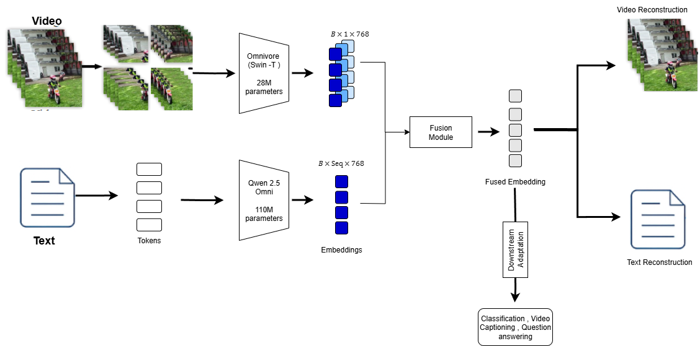

# Methodology: Multimodal AI:Audio-Visual-Text

**Student:** 210523T
**Research Area:** Multimodal AI:Audio-Visual-Text
**Date:** 2025-09-01

## 1. Overview

This research develops a compact multimodal AI model (OmniQ) integrating audio, visual, and text modalities for robust representation learning and efficient downstream performance. The methodology combines self-supervised pretraining with masked modeling, lightweight fusion transformers, and quantization for resource-efficient deployment.
## 2. Research Design
The study follows a hybrid research design:

- **Exploratory -** Review and adapt existing multimodal architectures (Omnivore, Qwen2.5-Omni).

- **Experimental -** Implement OmniQ and evaluate on benchmark datasets.

- **Comparative -** Benchmark against baseline unimodal and multimodal models to validate efficiency and accuracy gains.
## 3. Data Collection

### 3.1 Data Sources
 - **HowTo100M -** Large-scale video-text dataset for pretraining.

 - **CC12M -** Diverse image-text dataset for cross-modal alignment.

 - **UCF101 -** Standard video classification dataset for fine-tuning.
### 3.2 Data Description
| Dataset       | Modalities     | Size       | Usage       | Description                                                                                   |
| ------------- | -------------- | ---------- | ----------- | --------------------------------------------------------------------------------------------- |
| **HowTo100M** | Video + Text   | 100M clips | Pretraining | Large-scale unlabeled video–text dataset, ideal for masked modeling and cross-modal learning. |
| **CC12M**     | Image + Text   | 12M pairs  | Pretraining | Diverse image–text dataset, improves visual-textual alignment.                                |
| **UCF101**    | Video + Labels | 13K videos | Fine-tuning | Standard video classification dataset with 101 action categories.                             |

### 3.3 Data Preprocessing
- Frame extraction (uniform sampling at 25–30 FPS).

- Audio extraction (16kHz, MFCC features if needed).

- Tokenization of text captions with Qwen2.5-Omni tokenizer.

- Data augmentations: random crops, flips, Gaussian blur, modality dropout (20%).

- Normalization for consistency across modalities.
## 4. Model Architecture

- **Pretraining** -  Use self-supervised masked modeling on large-scale video-text datasets (HowTo100M, CC12M). Mask 30–50% of visual patches and 15–30% of text tokens for cross-modal reconstruction.

- **Architecture** -

    - **Visual encoder:**  Omnivore’s Swin Transformer-Tiny for images/videos.

    - **Text encoder:**  Qwen2.5-Omni embeddings.

    - **Fusion module:**  Lightweight transformer encoder with LoRA adapters.

- **Optimization** -  Apply 4-bit quantization and sparse attention for reduced latency (<50ms on CPU).

- **Fine-tuning** -  Use UCF101 for action recognition, extend to retrieval and QA tasks.

*Figure 1: Model Architecture. The video and text input paths of the OmniQ model, illustrating the processing of image/video inputs through Omnivore’s Swin Transformer-Tiny and text inputs through Qwen2.5-Omni’s tokenizer and embedding layer, converging at the fusion module with a concatenate operation to produce fused embeddings for self-supervised masked modeling. 𝐵 : Batch size*

## 5. Experimental Setup

### 5.1 Evaluation Metrics
[List evaluation metrics you'll use]

### 5.2 Baseline Models
[Describe baseline comparisons]

### 5.3 Hardware/Software Requirements
[List computational requirements]

## 6. Implementation Plan

| Phase | Tasks | Duration | Deliverables |
|-------|-------|----------|--------------|
| Phase 1 | Data preprocessing | 2 weeks | Clean dataset |
| Phase 2 | Model implementation | 3 weeks | Working model |
| Phase 3 | Experiments | 2 weeks | Results |
| Phase 4 | Analysis | 1 week | Final report |

## 7. Risk Analysis

- **Risk 1 -** GPU Memory Constraints → Mitigation: Apply gradient checkpointing, mixed precision, smaller batch sizes.

- **Risk 2 -** Dataset Noise → Mitigation: Use modality dropout + augmentations for robustness.

- **Risk 3 -** Training Time Overhead → Mitigation: Use transfer learning + freeze visual encoder for early epochs.

- **Risk 4 -** Model Overfitting → Mitigation: Early stopping, regularization, dropout.
## 8. Expected Outcomes

- A compact multimodal model (<200M params, <50ms CPU inference).

- Strong benchmark results (≥80% Top-1 on UCF101, ≥75% VQA accuracy).

- Demonstration of improved efficiency vs. large MLLMs.

- Open-source multimodal AI pipeline for reproducibility.
---

**Note:** Update this document as your methodology evolves during implementation.