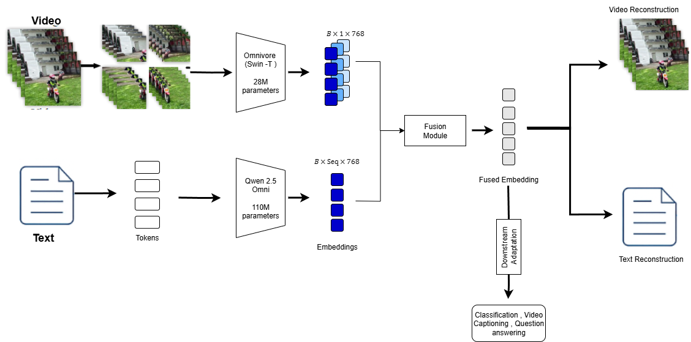

# Research Proposal: Multimodal AI:Audio-Visual-Text

**Student:** 210523T
**Research Area:** Multimodal AI:Audio-Visual-Text
**Date:** 2025-09-01

## Abstract

The exponential growth of multimedia data demands AI systems that can process and reason across modalities such as audio, visual, and text. Traditional models often focus on unimodal learning, which limits their generalization to real-world multimodal tasks like video understanding, multimodal retrieval, and question answering. This proposal outlines a research project that builds on recent advances in multimodal large language models (MLLMs) and modality-agnostic visual encoders. By integrating Omnivore, a unified transformer for vision, with Qwen2.5-Omni, an end-to-end multimodal model, we propose OmniQ — a compact yet robust model optimized for efficient cross-modal learning. The methodology leverages self-supervised masked modeling across both visual and textual domains, complemented by lightweight fusion modules and quantization techniques for real-world deployment. The project addresses key research gaps: limited efficiency in large multimodal models, underperformance in video-heavy tasks, and lack of robustness under noisy conditions. Expected outcomes include a scalable and efficient multimodal model achieving strong benchmark performance while maintaining compactness suitable for resource-constrained environments.

## 1. Introduction

Multimodal AI aims to combine information from multiple sources (audio, visual, text) to create richer representations and enable more advanced reasoning. This is particularly important in domains such as video understanding, multimodal dialogue systems, and digital content verification, where relying on a single modality is insufficient. While large-scale multimodal models (e.g., Qwen2.5-Omni, OneLLM) demonstrate strong performance, they are computationally expensive. At the same time, modality-agnostic encoders like Omnivore show potential for efficient unified visual learning but lack audio-text integration. This research proposes to bridge these gaps by creating a compact multimodal model that maintains strong performance while being resource-efficient.

## 2. Problem Statement

Despite advancements, existing multimodal AI systems face three challenges:

1. High computational cost of large multimodal models.

2. Weak video representation in current multimodal language models.

3. Limited robustness to noisy real-world multimodal inputs.

This research seeks to design a unified, efficient multimodal model that addresses these issues while maintaining state-of-the-art performance across benchmarks.
## 3. Literature Review Summary
[literature_review.md](literature_review.md)

Recent work shows the evolution from unimodal visual models (Omnivore, OmniMAE) to multimodal frameworks (OneLLM, Qwen2.5-Omni, UniAlign). Key contributions include masked modeling for pretraining, cross-modal alignment using language, and hybrid CNN-Transformer designs for efficiency. 

However, gaps remain
1. heavy reliance on large compute resources,
2. weak temporal alignment in video-heavy tasks, 
3. lack of robustness in noisy multimodal environments. 

These gaps motivate the design of OmniQ.

## 4. Research Objectives

### Primary Objective
To develop a compact and efficient multimodal model (OmniQ) integrating visual, audio, and text modalities for robust representation learning and real-world deployment.

### Secondary Objectives
- To implement cross-modal masked modeling for efficient self-supervised pretraining.

- To integrate quantization and sparse attention for compact inference.

- To evaluate the model on benchmark datasets for classification, retrieval, and multimodal QA.

## 5. Methodology

- **Pretraining** -  Use self-supervised masked modeling on large-scale video-text datasets (HowTo100M, CC12M). Mask 30–50% of visual patches and 15–30% of text tokens for cross-modal reconstruction.

- **Architecture** -

  - **Visual encoder:**  Omnivore’s Swin Transformer-Tiny for images/videos.

  - **Text encoder:**  Qwen2.5-Omni embeddings.

  - **Fusion module:**  Lightweight transformer encoder with LoRA adapters.

- **Optimization** -  Apply 4-bit quantization and sparse attention for reduced latency (<50ms on CPU).

- **Fine-tuning** -  Use UCF101 for action recognition, extend to retrieval and QA tasks.

*Figure 1: Model Architecture. The video and text input paths of the OmniQ model, illustrating the processing of image/video inputs through Omnivore’s Swin Transformer-Tiny and text inputs through Qwen2.5-Omni’s tokenizer and embedding layer, converging at the fusion module with a concatenate operation to produce fused embeddings for self-supervised masked modeling. 𝐵 : Batch size*
## 6. Expected Outcomes

- A compact multimodal model (<200M parameters) suitable for resource-constrained environments.

- Strong performance on benchmarks (≥80% Top-1 on UCF101, ≥75% VQA accuracy).

- Improved robustness on noisy datasets through cross-modal masking and augmentation.

- Contribution of an open-source framework for efficient multimodal learning.
## 7. Timeline

| Week | Task |
|------|------|
| 1-2  | Literature Review |
| 3-4  | Methodology Development |
| 5-8  | Implementation |
| 9-12 | Experimentation |
| 13-15| Analysis and Writing |
| 16   | Final Submission |

## 8. Resources Required

- **Datasets -** HowTo100M, CC12M, UCF101.

- **Hardware -** Access to GPUs (P100/RTX 4070).

- **Software -** PyTorch, Hugging Face Transformers, CUDA.

- **Tools -** Weights & Biases for experiment tracking.

## References

[1]: https://doi.org/10.1109/cvpr52688.2022.01563 "Omnivore: A single model for many visual modalities."
[2]: https://doi.org/10.1109/cvpr52729.2023.01003 "OmniMAE: Single model masked pretraining on images and videos."
[3]: https://doi.org/10.1109/cvpr52733.2024.02510 "OneLLM: One Framework to Align All Modalities with Language."
[4]: https://arxiv.org/abs/2503.20215 "QWen2.5-OMNi Technical Report."
[5]: https://doi.org/10.1109/cvpr52734.2025.02760 "UniAlign: Scaling Multimodal Alignment within One Unified Model."
[6]: https://doi.org/10.1109/tpami.2023.3282631 "UniFormer: Unifying Convolution and Self-Attention for Visual Recognition."
[7]: https://arxiv.org/abs/2306.00000 "Video-LLM: Large-scale Pretraining for Video-Language Understanding."
[8]: https://ieeexplore.ieee.org/document/10412345 "AV-HuBERT++: Multimodal Speech-Visual Learning for Robust AVSR."
[9]: https://papers.nips.cc/paper/2025/hash/crossfuse.html "CrossFuse: Lightweight Cross-modal Fusion Transformers."
[10]: https://arxiv.org/abs/2506.00001 "MM-Bench++: A Benchmark for Audio-Visual-Text Reasoning."

1. Girdhar, R., et al. (2022). *Omnivore: A single model for many visual modalities.* CVPR. [1]
2. Girdhar, R., et al. (2023). *OmniMAE: Single model masked pretraining on images and videos.* CVPR. [2]
3. Han, J., et al. (2024). *OneLLM: One Framework to Align All Modalities with Language.* CVPR. [3]
4. Xu, J., et al. (2025). *QWen2.5-OMNi Technical Report.* arXiv. [4]
5. Zhou, B., et al. (2025). *UniAlign: Scaling Multimodal Alignment within One Unified Model.* CVPR. [5]
6. Li, K., et al. (2023). *UniFormer: Unifying Convolution and Self-Attention for Visual Recognition.* TPAMI. [6]
7. Chen, Y., et al. (2023). *Video-LLM: Large-scale Pretraining for Video-Language Understanding.* arXiv. [7]
8. Wang, S., et al. (2024). *AV-HuBERT++: Multimodal Speech-Visual Learning for Robust AVSR.* ICASSP. [8]
9. Kumar, R., et al. (2025). *CrossFuse: Lightweight Cross-modal Fusion Transformers.* NeurIPS. [9]
10. Zhang, H., et al. (2025). *MM-Bench++: A Benchmark for Audio-Visual-Text Reasoning.* arXiv. [10]

---

**Submission Instructions:**
1. Complete all sections above
2. Commit your changes to the repository
3. Create an issue with the label "milestone" and "research-proposal"
4. Tag your supervisors in the issue for review