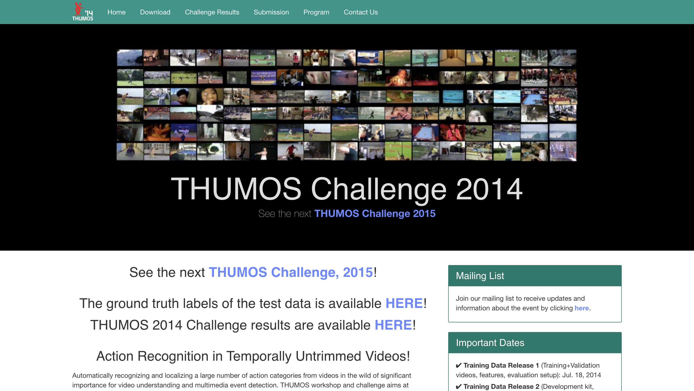

# THUMOS14 Dataset

**THUMOS14** is a large-scale video dataset designed for action recognition and temporal action localization. It's a challenging dataset that contains temporally untrimmed videos, meaning the action of interest is only a small part of the entire video. This makes it a great benchmark for models that can identify not just _what_ action is happening, but also _when_ it's happening.

## Key Features:

- **Untrimmed Videos:** This is a key characteristic of the dataset. Models need to be robust to background clutter and identify the specific temporal segments containing the action.
- **20 Action Classes:** The dataset covers a diverse range of 20 action categories.
- **Large-Scale:** It includes over 1,000 videos for validation and over 1,500 for testing, providing a substantial amount of data for training and evaluation.
- **Temporal Annotations:** The dataset provides temporal annotations, specifying the start and end times of each action instance within the videos.

## Download Links:

- **Official Raw Dataset:** [THUMOS14 Official Website](https://www.crcv.ucf.edu/THUMOS14/home.html)
- **Annotations and I3D Features:** [Google Drive](https://drive.google.com/file/d/1zt2eoldshf99vJMDuu8jqxda55dCyhZP/view)
