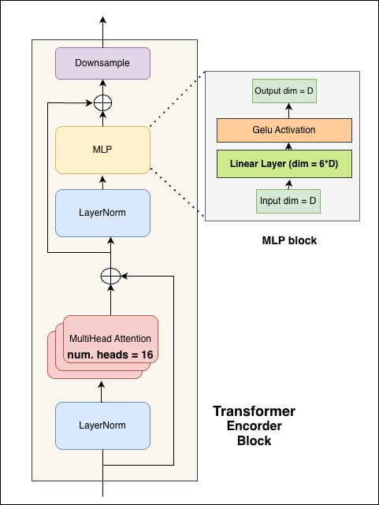
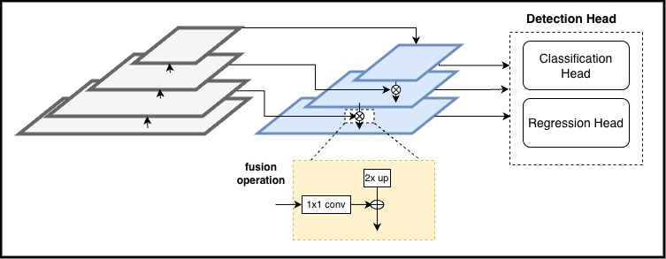

# Methodology: Multi-Modal Learning:Video Understanding

**Student:** 210536K
**Research Area:** Multi-Modal Learning:Video Understanding
**Date:** 2025-10-19

---

## 1. Overview

This research introduces the **Temporal Boundary Transformer (TBT-Former)**, a new single-stage, anchor-free model for Temporal Action Localization (TAL). The methodology is centered on enhancing the strong **ActionFormer** baseline to address two key limitations: imprecise localization of actions with ambiguous ("fuzzy") temporal boundaries and suboptimal fusion of multi-scale contextual information.

Our approach introduces three core architectural improvements:
1.  A **Scaled Transformer Backbone** with higher capacity for more powerful temporal feature extraction.
2.  A **Cross-Scale Feature Pyramid Network (CS-FPN)** to enable richer fusion of high-level semantics and low-level temporal details.
3.  A novel **Boundary Distribution Regression (BDR) Head**, which recasts boundary prediction as a probability distribution learning problem to explicitly model temporal uncertainty.

The final model is evaluated on three standard TAL benchmarks to demonstrate its effectiveness and establish a new state-of-the-art.

---

## 2. Research Design

The research follows a quantitative, experimental design. The overall approach is to:
1.  **Identify Limitations:** Analyze the architecture of the state-of-the-art ActionFormer model to identify specific weaknesses in boundary regression and multi-scale feature fusion.
2.  **Propose a Novel Architecture:** Develop TBT-Former by making targeted modifications to the ActionFormer baseline. Each modification is designed to address a specific identified limitation.
3.  **Implement and Train:** Implement the proposed model and train it on large-scale, standard benchmark datasets for temporal action localization.
4.  **Evaluate and Compare:** Rigorously evaluate the model's performance against the original ActionFormer baseline and other state-of-the-art methods using standard evaluation protocols.
5.  **Ablate and Validate:** Conduct a comprehensive set of ablation studies to systematically validate the contribution of each new architectural component and analyze the sensitivity to key hyperparameters.

---

## 3. Data Collection

### 3.1 Data Sources
The study utilizes three widely-adopted and challenging public datasets for Temporal Action Localization:
* **THUMOS14**
* **ActivityNet-1.3**
* **EPIC-Kitchens 100**

### 3.2 Data Description
* **THUMOS14:** A standard TAL benchmark known for its long, untrimmed videos and high density of action instances across 20 categories. It is ideal for evaluating localization precision.
* **ActivityNet-1.3:** A large-scale dataset containing ~20,000 videos across 200 diverse action classes, serving as a robust test for model generalization.
* **EPIC-Kitchens 100:** The largest dataset for egocentric (first-person view) action understanding, featuring numerous short, fine-grained actions defined by verb-noun pairs. It tests the model's ability to handle brief, object-centric interactions.

### 3.3 Data Preprocessing
The model is trained on pre-extracted video features, following the standard pipeline used by ActionFormer and other contemporary methods. This involves processing raw videos through a frozen feature extractor (e.g., I3D) to generate a sequence of feature vectors, which serve as the input to the TBT-Former architecture. Standard data augmentation techniques for the temporal dimension are applied during training.

---

## 4. Model Architecture

TBT-Former is built upon the single-stage, anchor-free ActionFormer framework. It enhances this baseline with the following key modules, as illustrated in the overall architecture below.

### 4.1 Scaled Transformer Backbone
To improve the model's capacity for learning complex temporal dependencies, the Transformer encoder backbone is scaled up. Compared to the baseline, the number of attention heads in each Multi-Head Self-Attention (MSA) block is increased from **8 to 16**, and the hidden dimension of the feed-forward network (FFN) is expanded by a factor of **6x** relative to the input dimension (up from 4x). This provides greater representational power to capture nuanced temporal patterns.

### 4.2 Cross-Scale Feature Pyramid (CS-FPN)
To improve the fusion of multi-scale features, we replace the simple feed-forward pyramid in ActionFormer with a CS-FPN. This architecture introduces a **top-down pathway with lateral connections**, allowing semantically rich information from coarse feature levels to flow back and refine temporally precise features at finer levels. The fusion operation merges an upsampled feature map $P_{i+1}$ with a backbone feature map $C_i$ from the corresponding level via a $1 \times 1$ convolution and element-wise addition:

$$P_i = \text{Conv}_{1 \times 1}(C_i) + \text{Upsample}(P_{i+1})$$

This ensures all pyramid levels have access to both high-level semantic context and high-resolution details.

### 4.3 Boundary Distribution Regression (BDR) Head
The BDR head is our main contribution for addressing ambiguous action boundaries. Instead of regressing a single offset for the start and end times, the BDR head learns a **flexible probability distribution** over a range of possible temporal locations. The final boundary coordinate is calculated as the expectation of this learned distribution:

$$\hat{d^s} = \sum_{i=0}^{W-1} i \cdot p_s(i)$$

This allows the model to represent its uncertainty, leading to more robust localization. The head is trained with the **Distribution Focal Loss (DFL)**, which encourages the probability mass to concentrate around the true continuous boundary location:

$$\mathcal{L}_{DFL}(P_s, d^s_{gt}) = -((i+1 - d^s_{gt})\log(p_s(i)) + (d^s_{gt} - i)\log(p_s(i+1)))$$

---

## 5. Experimental Setup

### 5.1 Evaluation Metrics
Model performance is evaluated using the standard metric for TAL: **mean Average Precision (mAP)**. The mAP is calculated at various temporal Intersection over Union (tIoU) thresholds, including [0.3, 0.4, 0.5, 0.6, 0.7] for THUMOS14 and an average over [0.5:0.05:0.95] for ActivityNet-1.3.

### 5.2 Baseline Models
Our primary baseline is **ActionFormer**. We also compare TBT-Former's performance against a comprehensive set of other state-of-the-art single-stage and two-stage models, including:
* GTAN
* A2Net
* BMN
* PGCN
* G-TAD
* AFSD

### 5.3 Hardware/Software Requirements
The implementation and experiments require a standard deep learning environment.
* **Hardware:** High-performance computing servers equipped with modern GPUs (e.g., NVIDIA A100 or V100) with sufficient VRAM for training large Transformer models.
* **Software:** A Python-based deep learning framework such as PyTorch, along with standard libraries like NumPy and pandas for data handling.

---

## 6. Implementation Plan

| Phase   | Tasks                                                                           | Duration | Deliverables                                 |
|---------|---------------------------------------------------------------------------------|----------|----------------------------------------------|
| Phase 1 | Literature Review & Data Preparation                                            | 2 weeks  | Preprocessed feature sets for all datasets   |
| Phase 2 | Model Implementation: Scaled Backbone, CS-FPN, BDR Head                         | 3 weeks  | Complete, debugged TBT-Former source code    |
| Phase 3 | Experiments: Training & Evaluation on THUMOS14, ActivityNet, EPIC-Kitchens      | 3 weeks  | Raw performance metrics and trained models   |
| Phase 4 | Ablation Studies & Analysis: Component validation, hyperparameter tuning, etc.  | 2 weeks  | Final results, comparative tables, and figures |

---

## 7. Risk Analysis

* **Risk 1: Negative Results:** The proposed architectural changes might not yield significant improvements over the strong ActionFormer baseline.
    * **Mitigation:** Conduct systematic ablation studies to isolate the impact of each component. If a component is ineffective, it can be refined or replaced. Hyperparameter tuning will be performed to ensure the model is optimally configured.
* **Risk 2: Computational Constraints:** Training large Transformer-based models on extensive video datasets is computationally expensive and may exceed available resources.
    * **Mitigation:** Begin experiments on the smaller THUMOS14 dataset for faster prototyping and debugging. Utilize mixed-precision training and gradient accumulation to manage memory usage. Secure access to cloud computing resources if necessary.
* **Risk 3: Implementation Errors:** Bugs in the implementation of the novel components (especially the BDR head and its custom loss function) could lead to poor performance or training instability.
    * **Mitigation:** Develop thorough unit tests for each new module. Validate the implementation by first replicating the baseline ActionFormer results before integrating new components.

---

## 8. Expected Outcomes

* A novel TAL architecture, **TBT-Former**, that demonstrates superior performance over existing state-of-the-art methods.
* **New state-of-the-art results** on the challenging THUMOS14 and EPIC-Kitchens 100 benchmarks, with competitive performance on the large-scale ActivityNet-1.3 dataset.
* Strong empirical evidence that modeling temporal boundaries as probability distributions via the **BDR head** is an effective strategy for improving localization accuracy, especially for actions with ambiguous boundaries.
* A comprehensive **ablation study** that validates the design choices and quantifies the specific performance contribution of each architectural enhancement.
* The release of the source code to the community to facilitate future research.