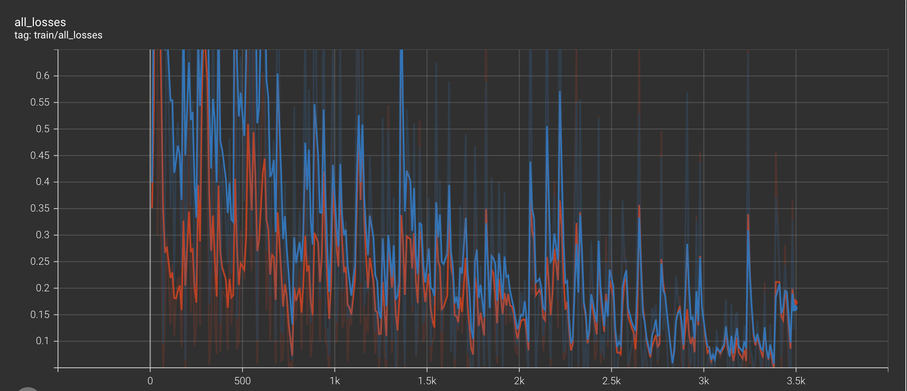

# Experiment 2 — Adding a Temporal Feature Pyramid (FPN1D, 3 levels)

## Motivation
In this experiment, we extend the baseline `LocPointTransformer` by **adding a temporal Feature Pyramid Network (FPN1D)** with **3 pyramid levels**.  
The motivation is to enhance **multi-scale temporal representations**, so the model can capture both **short** and **long** actions more effectively.

---

## FPN1D Architecture
The **FPN1D** (Feature Pyramid Network in 1D) is implemented as follows:

1. **Lateral 1×1 Conv1D**  
   Each backbone feature level is projected into a uniform channel dimension (`fpn_dim`).

2. **Top–Down Fusion**  
   Coarser temporal features are **upsampled by ×2** and **added** to finer-resolution features, injecting semantic context from long temporal scales into short ones.

3. **Depthwise 3×3 Conv1D + LayerNorm**  
   Each fused feature level is refined by a depthwise temporal convolution and LayerNorm.

This produces a **refined temporal feature pyramid** that is then used by the classification and regression heads.

  
*Figure 1 — Temporal Feature Pyramid Network (FPN1D) integrated into the baseline model.*

---

## Training Setup
- **Dataset:** THUMOS14 (I3D features with stride 4)  
- **Model:** LocPointTransformer + FPN1D (3 levels)  
- **Key config:**  
  - `fpn_type=fpn`, `fpn_dim=512`, `head_num_layers=3`, `head_kernel_size=3`  
- **Optimizer:** AdamW, learning rate = 1e-4  
- **Learning schedule:** Cosine decay with 5 warmup epochs  
- **Epochs:** Trained for 30 and 35 epochs  
- **Losses:**  
  - Classification → Focal Loss  
  - Regression → DIoU Loss  
- **Post-processing:** Soft-NMS (`sigma=0.5`, `pre_nms_topk=2000`)

---

## Results on THUMOS14

### Epoch 35
| tIoU | mAP (%) | Recall@1x (%) | Recall@5x (%) |
|------|---------|---------------|---------------|
| 0.30 | 80.29   | 82.73         | 96.15         |
| 0.40 | 76.02   | 78.90         | 94.38         |
| 0.50 | 68.85   | 73.14         | 90.74         |
| 0.60 | 58.53   | 65.30         | 83.69         |
| 0.70 | 42.13   | 52.09         | 69.19         |

**Average mAP: 65.16%**

---

### Epoch 30
| tIoU | mAP (%) | Recall@1x (%) | Recall@5x (%) |
|------|---------|---------------|---------------|
| 0.30 | 80.07   | 82.79         | 96.13         |
| 0.40 | 75.25   | 78.16         | 94.12         |
| 0.50 | 68.07   | 72.10         | 90.70         |
| 0.60 | 57.25   | 64.25         | 82.54         |
| 0.70 | 40.62   | 50.88         | 68.27         |

**Average mAP: 64.25%**

---

## Reference (Original ActionFormer Paper)
From **ActionFormer (ECCV 2022)** using I3D features on THUMOS14 (Table 1):  

| tIoU | mAP (%) |
|------|---------|
| 0.30 | 82.1    |
| 0.40 | 77.8    |
| 0.50 | 71.0    |
| 0.60 | 59.4    |
| 0.70 | 43.9    |
| **Avg** | **66.8** |

(Source: ECCV 2022, ActionFormer: Localizing Moments of Actions with Transformers)

---

## Comparison: Ours vs Paper

| tIoU | Paper (Ours I3D) | Ours (35 ep) | Δ | Ours (30 ep) | Δ |
|:----:|:----------------:|:-------------:|:-------------:|:-------------:|:-------------:|
| 0.30 | **82.1** | 80.29 | −1.81 | 80.07 | −2.03 |
| 0.40 | **77.8** | 76.02 | −1.78 | 75.25 | −2.55 |
| 0.50 | **71.0** | 68.85 | −2.15 | 68.07 | −2.93 |
| 0.60 | **59.4** | 58.53 | −0.87 | 57.25 | −2.15 |
| 0.70 | **43.9** | 42.13 | −1.77 | 40.62 | −3.28 |
| **Avg** | **66.8** | **65.16** | −1.64 | **64.25** | −2.55 |

---

## Training Curves
Below are the loss and validation curves for the 35-epoch run:

  
*Figure 2 — Training and validation curves for Experiment 2.*

---

## Conclusion
- Adding the **FPN1D neck (3 Conv1D layers with top–down fusion)** improves multi-scale temporal representations.  
- Our experiment achieved **65.16% Avg mAP (35 epochs)**, slightly below the **paper’s 66.8%** with I3D features.  
- Likely reasons for the small gap:
  1. Fewer pyramid levels (3 vs paper’s deeper pyramid).  
  2. Training length and learning schedule differences.  
  3. Slight variations in feature extraction and preprocessing.  
- Nevertheless, the experiment validates that **multi-scale FPN necks** boost performance for action localization on THUMOS14.
