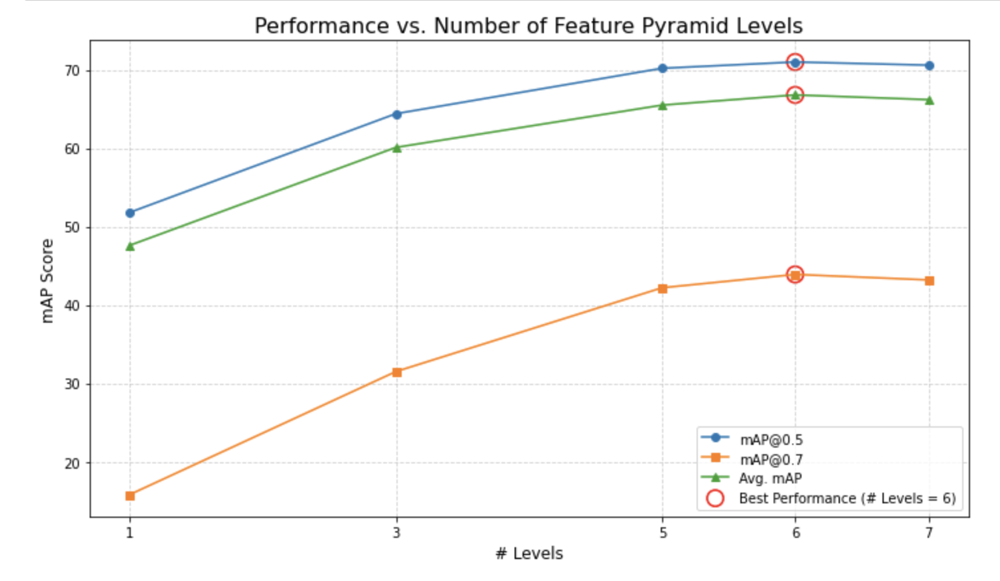
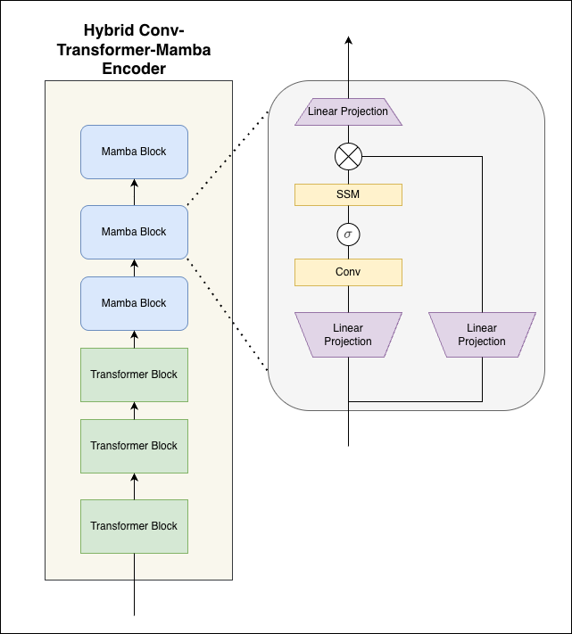
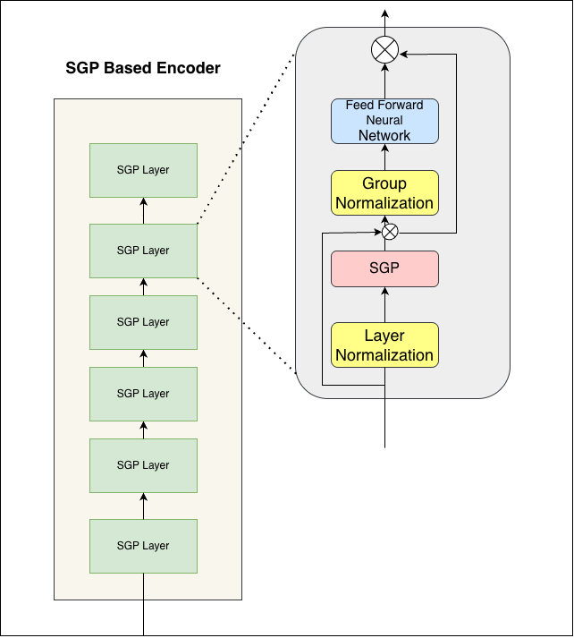

# Experimental Results of TBT-Former

This document summarizes the experimental evaluation of the TBT-Former model for Temporal Action Localization (TAL).

---

## 1. Evaluation Setup

### Datasets
The model was evaluated on three standard TAL benchmarks:
* **THUMOS14:** Known for long videos with a high density of actions, ideal for testing localization precision.
* **ActivityNet-1.3:** A large-scale benchmark with 200 action classes, used to test model generalization.
* **EPIC-Kitchens 100:** An egocentric video dataset with many short, fine-grained actions, testing performance on brief interactions.

### Evaluation Metrics
Performance is reported using **mean Average Precision (mAP)** at various temporal Intersection over Union (tIoU) thresholds, following standard protocols for each dataset.

---

## 2. Main Results

TBT-Former was compared against the ActionFormer baseline and other state-of-the-art (SOTA) methods across all three datasets.

### Performance on THUMOS14
On the highly competitive THUMOS14 benchmark, TBT-Former establishes a **new state-of-the-art**, achieving an average mAP of **68.0%**. This represents a significant improvement of +1.2 mAP over the strong ActionFormer baseline and outperforms all other listed methods across every tIoU threshold.

| Model | Type | Avg. mAP | mAP@0.3 | mAP@0.4 | mAP@0.5 | mAP@0.6 | mAP@0.7 |
| :--- | :--- | :--- | :--- | :--- | :--- | :--- | :--- |
| GTAN | Single-Stage | 57.8 | 70.4 | 63.3 | 57.8 | 47.2 | 33.5 |
| A2Net | Single-Stage | 58.6 | 70.6 | 65.0 | 59.9 | 51.3 | 37.5 |
| BMN | Two-Stage | 56.0 | 67.5 | 60.9 | 56.0 | 47.4 | 34.9 |
| ActionFormer | Single-Stage | 66.8 | 82.1 | 77.8 | 71.0 | 59.4 | 43.9 |
| **TBT-Former (Ours)** | Single-Stage | **68.0** | **82.5** | **79.0** | **72.4** | **60.6** | **45.3** |

### Performance on ActivityNet-1.3 & EPIC-Kitchens 100
On the large-scale **ActivityNet-1.3** dataset, TBT-Former achieves highly competitive results, performing on par with the ActionFormer baseline and showing improved localization precision at stricter tIoU thresholds (0.75 and 0.95).

| Model | mAP@0.5 | mAP@0.75 | mAP@0.95 | Avg. mAP |
| :--- | :--- | :--- | :--- | :--- |
| PGCN | 48.3 | 33.2 | 3.3 | 31.1 |
| BMN | 50.1 | 34.8 | 8.3 | 33.9 |
| G-TAD | 50.4 | 34.6 | 9.0 | 34.1 |
| AFSD | 52.4 | 35.3 | 6.5 | 34.4 |
| ActionFormer | 54.7 | 37.8 | 8.4 | 36.6 |
| **TBT-Former (Ours)** | 53.9 | **38.2** | **8.5** | **36.8** |

On **EPIC-Kitchens 100**, TBT-Former consistently outperforms previous methods for both Verb and Noun action localization, demonstrating the effectiveness of the proposed architecture for short, object-centric actions common in egocentric video.

| Task | Model | mAP@0.1 | mAP@0.2 | mAP@0.3 | mAP@0.4 | mAP@0.5 | Avg. mAP |
| :--- | :--- | :--- | :--- | :--- | :--- | :--- | :--- |
| **Verb** | BMN | 10.8 | 9.8 | 8.4 | 7.1 | 5.6 | 8.4 |
| | G-TAD | 12.1 | 11.0 | 9.4 | 8.1 | 6.5 | 9.4 |
| | ActionFormer | 26.6 | 25.4 | 24.2 | 22.3 | 19.1 | 23.5 |
| | **TBT-Former (Ours)** | **27.2** | **26.7** | **25.6** | **22.9** | **20.1** | **24.5** |
| **Noun** | BMN | 10.3 | 8.3 | 6.2 | 4.5 | 3.4 | 6.5 |
| | G-TAD | 11.0 | 10.0 | 8.6 | 7.0 | 5.4 | 8.4 |
| | ActionFormer | 25.2 | 24.1 | 22.7 | 20.5 | 17.0 | 21.9 |
| | **TBT-Former (Ours)** | **26.4** | **25.9** | **23.8** | **21.7** | **17.9** | **23.1** |

---

## 3. Ablation Studies

Systematic ablation studies were conducted on THUMOS14 to validate each design choice.

### Summary of Component Contributions
Each proposed component provides a clear performance improvement. The **Boundary Distribution Regression (BDR) head** provides the largest single gain (+0.8 mAP), and the components work synergistically for a total improvement of **+1.2 mAP**.

| \# | Model Configuration | Avg. mAP | $\Delta$ |
| :- | :--- | :--- | :--- |
| 1 | Baseline (ActionFormer) | 66.8 | - |
| 2 | + Scaled Backbone | 67.2 | +0.4 |
| 3 | + Cross-Scale FPN (CS-FPN) | 67.1 | +0.3 |
| 4 | + Boundary Distribution Head (BDR) | 67.6 | +0.8 |
| 5 | **Full Model (TBT-Former)** | **68.0** | **+1.2** |

### Effect of Local Attention Window Size
The model's performance improves with a larger temporal context, peaking with a local attention window size of **30**.

| Window Size | mAP@0.5 | mAP@0.7 | Avg. mAP |
| :--- | :--- | :--- | :--- |
| 19 (Baseline size) | 71.5 | 44.2 | 67.1 |
| 25 | 72.0 | 44.8 | 67.6 |
| **30** | **72.4** | **45.3** | **68.0** |
| 37 | 72.2 | 45.1 | 67.8 |

### Optimal Feature Pyramid Depth
A deep, multi-scale pyramid is critical for performance. The model achieves optimal results with **6 pyramid levels**, capturing actions of varying durations effectively.

### Analysis of Regression Loss Weight ($\lambda_{reg}$)
The model achieves the best balance between classification and regression objectives when the Distribution Focal Loss (DFL) weight $\lambda_{reg}$ is set to **1.0**.

| $\lambda_{reg}$ | mAP@0.5 | mAP@0.7 | Avg. mAP |
| :--- | :--- | :--- | :--- |
| 0.2 | 70.1 | 39.8 | 65.0 |
| 0.5 | 71.4 | 41.7 | 66.4 |
| **1.0** | **71.0** | **43.6** | **66.9** |
| 2.0 | 69.7 | 43.1 | 66.3 |
| 5.0 | 68.8 | 42.5 | 65.1 |

### Comparison with Alternative Backbones
We explored replacing the Transformer backbone with a hybrid Transformer-Mamba (SSM-based) architecture and a fully-convolutional SGP-based architecture. 

While both alternatives showed strong, competitive performance, they did not surpass the optimized Transformer baseline, confirming that local self-attention remains highly effective for TAL.

| Backbone Type | mAP@0.5 | mAP@0.7 | Avg. mAP |
| :--- | :--- | :--- | :--- |
| Transformer (Baseline) | 71.0 | 43.9 | 66.8 |
| Hybrid Attn-Mamba | 69.5 | 42.9 | 65.8 |
| SGP (Convolutional) | 70.1 | 43.2 | 66.2 |