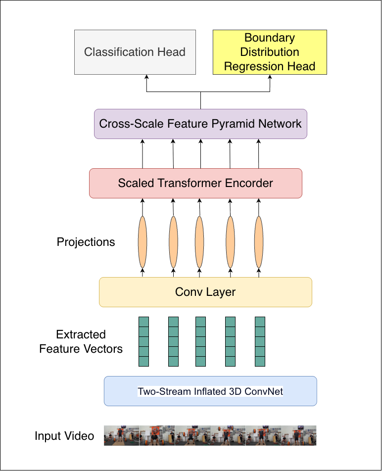

# TBT-Former: Learning Temporal Boundary Distributions for Action Localization

## Introduction

This repository contains the official implementation of **TBT-Former**, a new architecture for Temporal Action Localization (TAL). TBT-Former builds upon the strong and efficient ActionFormer baseline to address two key challenges: the precise localization of actions with ambiguous ("fuzzy") temporal boundaries and the effective fusion of multi-scale contextual information.

Our model introduces three core contributions:

1.  A **Scaled Transformer Backbone** with increased capacity for more powerful temporal feature extraction.
2.  A **Cross-Scale Feature Pyramid Network (CS-FPN)** that enables richer fusion of high-level semantics and low-level temporal details.
3.  A novel **Boundary Distribution Regression (BDR) Head**, inspired by Generalized Focal Loss, which recasts boundary prediction as a more flexible probability distribution learning problem.

Within the paradigm of Transformer-based architectures, TBT-Former establishes a new state-of-the-art on the highly competitive **THUMOS14** (68.0% avg. mAP, **+1.2%** over ActionFormer) and **EPIC-Kitchens 100** datasets, while remaining competitive on the large-scale **ActivityNet-1.3**. Our paper can be found on GitHub at [this link](https://github.com/aaivu/In21-S7-CS4681-AML-Research-Projects/tree/main/projects/210536K-Multi-Modal-Learning_Video-Understanding).



The key innovation is the Boundary Distribution Regression (BDR) head. Instead of regressing a single, deterministic offset for an action's start and end, the BDR head learns a flexible probability distribution over a range of possible locations. This allows the model to explicitly represent boundary uncertainty, leading to more robust and accurate localization, especially for actions with gradual transitions.

---

## Code Overview

The structure of this code repo is heavily inspired by the original ActionFormer implementation.

- `./libs/core`: Parameter configuration module.
- `./libs/datasets`: Data loader and IO module.
- `./libs/modeling`: Our main model, TBT-Former, with all its building blocks (Scaled Backbone, CS-FPN, BDR Head).
- `./libs/utils`: Utility functions for training, inference, and postprocessing.

---

## Installation

### Prerequisites

**System Requirements:**

- A machine with CUDA support (GPU with at least 12GB memory is recommended)
- Python 3.x

**Python Dependencies:**
All necessary Python packages are listed in [`requirements.txt`](../requirements.txt). Install them using:

```shell
pip install -r requirements.txt
```

### Compiling NMS Module

Part of NMS is implemented in C++. The code can be compiled by

```shell
cd ./libs/utils
python setup.py install --user
cd ../..
```

The code should be recompiled every time you update PyTorch.

---

## Reproducing Our Results on THUMOS14

### Download Features and Annotations

- Download `thumos.tar.gz` (`md5sum 375f76ffbf7447af1035e694971ec9b2`) from [this Box link](https://uwmadison.box.com/s/glpuxadymf3gd01m1cj6g5c3bn39qbgr) or [this Google Drive link](https://drive.google.com/file/d/1zt2eoldshf99vJMDuu8jqxda55dCyhZP/view?usp=sharing).
- The file includes I3D features, action annotations, and external classification scores.

**Details**: The features are extracted from two-stream I3D models pretrained on Kinetics using clips of `16 frames` at the video frame rate (`~30 fps`) and a stride of `4 frames`. This gives one feature vector per `4/30 ~= 0.1333` seconds.

### Unpack Features and Annotations

- Unpack the file under `./data` (or create a symlink to `./data`). The folder structure should look like this:

<!-- end list -->

```
TBT-Former/
│   README.md
│   ...
│
└───data/
    └───thumos/
        └───annotations/
        └───i3d_features/
```

### Training and Evaluation

- Train TBT-Former with I3D features. This will create an experiment folder under `./ckpt` that stores the config, logs, and checkpoints.

<!-- end list -->

```shell
python ./train.py ./configs/tbtformer_thumos_i3d.yaml --output reproduce_tbtformer
```

- (Optional) Monitor the training using TensorBoard:

<!-- end list -->

```shell
tensorboard --logdir=./ckpt/tbtformer_thumos_i3d_reproduce_tbtformer/logs
```

- Evaluate the trained model. The expected average mAP should be **68.0%**.

<!-- end list -->

```shell
python ./eval.py ./configs/tbtformer_thumos_i3d.yaml ./ckpt/tbtformer_thumos_i3d_reproduce_tbtformer
```

- **Note**: Training requires \~5GB GPU memory, but inference may require over 10GB. A GPU with at least 12GB of memory is recommended.


- The results (mAP at different tIoU thresholds) should be:

| Method         | 0.3  | 0.4  | 0.5  | 0.6  | 0.7  | **Avg**  |
| -------------- | ---- | ---- | ---- | ---- | ---- | -------- |
| **TBT-Former** | 82.5 | 79.0 | 72.4 | 60.6 | 45.3 | **68.0** |

---
- For the [ActivityNet 1.3](../data/ActivityNet.md) and [EPIC-Kitchens 100 datasets](../data/EPIC_Kitchens_100.md), you can follow the same procedure described for THUMOS14 to reproduce the results.
---

## Contact

- Thisara Rathnayaka (thisara.21@cse.mrt.ac.lk)

---
